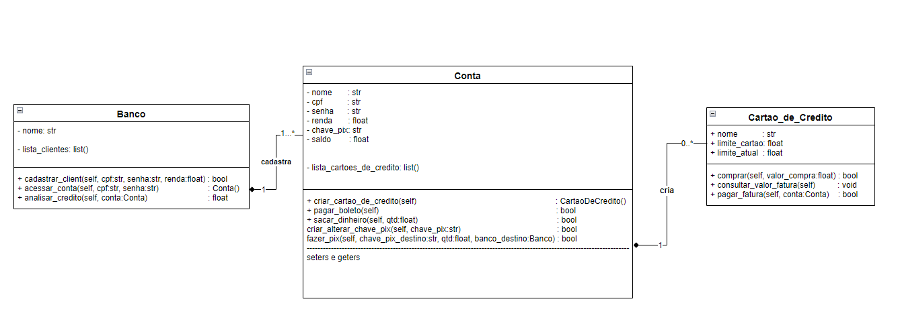

# <b>
Trilha Endenharia de Dados - IBM - Classes e Orientação a Objetos</b>
##### 
  Setembro 2022

***

## <b>
 Desafio Banco:</b>
* **Descrição:** Para práticar o aprendizado de Classes e Objetos iremos trabalhar com a representação de um Banco e suas funcionalidades.

***

## 
 <b>Classes Base:</b>

<code>

### <b>class Banco:</b>
    def __init__(self, nome_banco:str):

        self.nome = nome

        self.lista_clientes = list()

    
    def cadastrar_cliente(self, cpf:str, senha:str, renda:float) -> bool:
        '''Criar um objeto conta dado nome, cpf, senha e renda'''
        pass

    def acessar_conta(self, cpf:str, senha:str) -> Conta:
        '''Dado um cpf e senha, procurar a conta na lista de clientes e retornar a conta''''
        pass

    def analisar_credito(self, conta:Conta) -> float:
        '''Dada renda de uma conta, definir regras que retornem um limite adequado para o cliente''''
        pass

### <b>class Conta:</b>

    def __init__(self, nome:str, cpf:str, senha:str, renda:float, chave_pix:str, saldo:float):
        '''Terá atributos do usuário como:'''

        self.nome      = nome
        self.cpf       = cpf
        self.senha     = senha
        self.renda     = renda
        self.chave_pix = chave_pix
        self.saldo     = saldo
        
        self.lista_cartoes_de_credito = list()

    def criar_cartao_de_credito(self) -> CartaoDeCredito:
        '''Criar objeto cartao de credito na conta, dados limite e nome do cartão de crédito, chamará metodo de análise de crédito do banco
        para definir limite'''
        pass
    
    def pagar_boleto(self) -> bool:
        '''Pagar boleto dado valor'''
        pass
    
    def sacar_dinheiro(self, qtd:float) -> bool:
        pass 

    def depositar_dinheiro(self, qtd:float) -> bool:
        pass

    def criar_alterar_chave_pix(self, chave_pix:str) -> bool:
        pass

    def fazer_pix(self, chave_pix_destino:str, qtd:float, banco_destino:Banco) -> bool:
        '''Dada um objeto de conta origem, e uma chave pix destino, e quantidade da transferencia, fazer redução no saldo de uma conta e aumento de saldo na conta destino'''
        pass    
    

### <b>class CartaoDeCredito:</b>

    def __init__(self, nome_cartao:str, limite_total:float):

        self.nome_cartao   = nome_cartao
        
        self.limite_cartao = limite_total
        self.limite_atual  = limite_total

    def comprar(self, valor_compra:float) -> bool:
        '''Checar limite, se é possivel realizar a compra, reduzir limite, etc'''
        pass
    
    def consultar_valor_fatura(self):
        '''Retornar valor fatura'''
        pass

    def pagar_fatura(self, conta:Conta) -> bool:
        '''Pagar fatura, reistituir limite'''
        pass
    
</code>

***

## 
 **Desafio desenvolvido por:**
* #### Daniel Soares <i>-> Data Engineer</i>

## 
<b>Resolvido pelos integrantes:</b>
* #### Daniel Scheicher; Harão Tavares; Victoria Gomes; <i>-> Interns</i>

---

## 
 **Método:**
1. Por conta do desafio ter **3 (três) classes** e **3 (três) integrantes**, *cada integrante irá desenvolver uma classe*, para que todos tenham a oportunidade de serem protagonistas no projeto.
2. Também serão realizadas **Dailys** *às 10hrs da manhã*, para que os integrantes possam alinhar o andamento e colaborarem em grupo quanto a sugestões e eventuais dúvidas.
3. Além disso, será usado o **git e o github** para fins de descentralização e autonomia de desenvolvimento de código.
4. E, por fim, desenvolveu-se também um **diagrama UML** para representar as classes e suas relações.

## 
**Data de Entrega:**
* 16/09/2022  ->  totalizando 5 (cinco) dias úteis de desenvolvimento e 1 (uma) semana desde a entrega do desafio.

## 
**Resultados:**
> * Aprendizado:
    <ol>
        <li>**Escopo:** Foi criado um programa o qual, através das classes Banco, Conta e CartaDeCredito, é possível efetuar o cadastro de clientes, fazer o levamentamento dos dados dos mesmos e gerar cartões de crédito com analise de disponibilidade de crédito. </li>
        <li>**Daily**: 
            <ul>
                <li>
                    Bom: Comunicação efetiva para desenvolvimento do projeto, Alinhamento para conhecimento mútuo, Contribuição continua, oportunidade de um horario fixo para possibilidar ajuda planeja do Daniel (desafio desenvolvido por);
                </li>
                <li> 
                    Ruim: Sem gestor a parte para conduzir conteúdo, objetividade e tempo;
                </li>
                <li>
                    O que poderia manter: Efetividade de comunicação, bom relacionamento entre os integrantes e horário;
                </li>
                <li>
                    O que poderia melhorar: Prestar mais atenção com tempo, conteúdo e objetividade;
                </li>
            </ul>
        </li>
        <li>**Git/GitHub**:
            <ul>
                <li>
                    Bom: Aprendemos a solucionar problemas, paciência, documentação, conhecimento de desenvolvimento de codigo de forma colaborativa, resolver conflitos de codigo, organização de codigo, versionamento, cada um pode trabalhar de forma separada e ter sincronicidade de código;
                </li>
                <li> 
                    Ruim: Conflitos de codigo, dificuldades do primeiro contato, VSCode (nem todo mundo usava o VSCode para o git);
                </li>
                <li>
                    O que poderia manter: Organizacao, versionamento, colaboracao sincronizada;
                </li>
                <li>
                    O que poderia mudar: Aprender mais sobre Git e Comandos Linux;
                </li>
            </ul>
        </li>
        <li>**Diagrama UML**: 
            <ul>
                <li>
                    Bom: Ficou bonito no README.md;
                </li>
                <li> 
                    Ruim: Apenas um integrante realizou a construção, pois já tinha o conhecimento, e, por isso, os outros participantes não tiveram oportunidade de aprendizado nesta construção;
                </li>
                <li>
                    O que poderia manter: O README.md bonito;
                </li>
                <li>
                    O que poderia mudar: A construção poderia ter sido feita de forma conjunta para que todo mundo aprendesse um pouquinho; 
                </li>
            </ul>
        </li>
    </ol>

## 
**Conclusão:**
* A definir

#  <b>
The end
</b>
