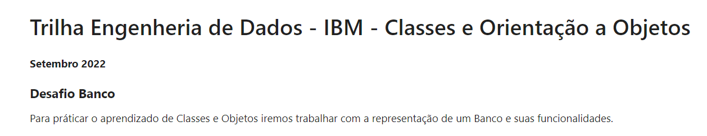
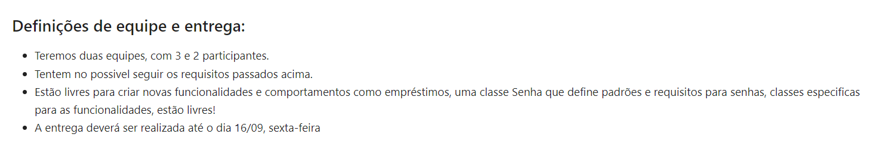
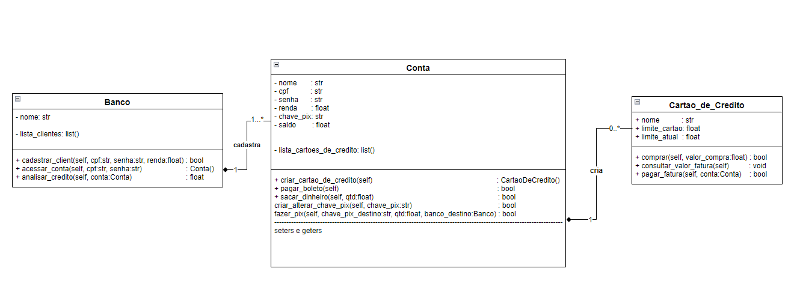

# :robot: IBM school of data engineering 
#### :mortar_board: *This folder contains the python POO challenge* :snake:

***

* ## Enunciado: :man_teacher:
Código com instruções no seguinte [link](./challenge_scope/desafio.ipynb). :point_left::computer_mouse:

* ## Resolução: :man_technologist::books:

### Seguir [resolução](./resolucao/). :point_left::computer_mouse:

Dividida em:

1. [Main code](./resolucao/main.ipynb) em Jupyter Notebook

2. Classes:

    1. [Banco](./resolucao/class_Banco.py)

    2. [Cartao de Credito](./resolucao/class_CartaoDeCredito.py)

    3. [Conta](./resolucao/class_Conta.py)

    4. [Classe suporte](./resolucao/class_Others/class_Depena_String.py)

3. [Documento](./README.md) de suporte.

 

- [x] **Aula de POO e envio do desafio:** 09/09/2022
- [x] **Entrega do desafio:** 16/09/2022
- [x] **Segunda aula, API com FLASK**: 30/09/2022
- [x] **Curso completo de API com FLASK**: [link](https://www.udemy.com/course/rest-apis-com-python-e-flask/?gclid=Cj0KCQjw--2aBhD5ARIsALiRlwBiyunW-IpKef2JKCfWl1x8tlyTEHj8QKx9iqGiQgmA8coBjoBjMp8aAgenEALw_wcB). 12 horas de curso.

Projetos de API com FLASK no [link](https://github.com/DanScherr/learning-courses/tree/main/python/api-restful). :point_left::computer_mouse:

 

:date: **Expectativa de entrega do desafio:** 1 semana.

:chart_with_upwards_trend: **Entrega do desafio:** 1 semana.

***

# <u>DESENVOLVIMENTO:</u>

# :man_technologist: Integrantes 

## **Desafio desenvolvido por:**
* #### Daniel Soares <i>-> Data Engineer</i>

## <b>Resolvido por:</b>
* #### Daniel Scheicher; Harão Tavares; Victoria Gomes; <i>-> Interns</i>

---

# :scientist: **Método:**
1. Por conta do desafio ter **3 (três) classes** e **3 (três) integrantes**, *cada integrante irá desenvolver uma classe*, para que todos tenham a oportunidade de serem protagonistas no projeto.
2. Também serão realizadas **Dailys** *às 10hrs da manhã*, para que os integrantes possam alinhar o andamento e colaborarem em grupo quanto a sugestões e eventuais dúvidas.
3. Além disso, será usado o **git e o github** para fins de descentralização e autonomia de desenvolvimento de código.
4. E, por fim, desenvolveu-se também um **diagrama UML** para representar as classes e suas relações.

# :date: **Data de Entrega:**
* 16/09/2022  ->  totalizando 5 (cinco) dias úteis de desenvolvimento e 1 (uma) semana desde a entrega do desafio.

# :detective: **Resultados:**
* ## Aprendizado:

1. ### **Escopo:** 

Foi criado um programa o qual, através das classes Banco, Conta e CartaDeCredito, é possível efetuar o cadastro de clientes, fazer o levamentamento dos dados dos mesmos e gerar cartões de crédito com analise de disponibilidade de crédito.

2. ### **Daily**: 

    1. **Bom:** Comunicação efetiva para desenvolvimento do projeto, Alinhamento para conhecimento mútuo, Contribuição continua, oportunidade de um horario fixo para possibilidar ajuda planeja do Daniel (desafio desenvolvido por);

    2. **Ruim:** Sem gestor a parte para conduzir conteúdo, objetividade e tempo;

    3. **O que poderia manter:** Efetividade de comunicação, bom relacionamento entre os integrantes e horário;

    4. **O que poderia melhorar:** Prestar mais atenção com tempo, conteúdo e objetividade;

3. ### **Git/GitHub**:

    1. **Bom:** Aprendemos a solucionar problemas, paciência, documentação, conhecimento de desenvolvimento de codigo de forma colaborativa, resolver conflitos de codigo, organização de codigo, versionamento, cada um pode trabalhar de forma separada e ter sincronicidade de código;

    2. **Ruim:** Conflitos de codigo, dificuldades do primeiro contato, VSCode (nem todo mundo usava o VSCode para o git);

    3. **O que poderia manter:** Organizacao, versionamento, colaboracao sincronizada;

    4. **O que poderia mudar:** Aprender mais sobre Git e Comandos Linux;

4. ### **Diagrama UML**: 

    1. **Bom:** Ficou bonito no README.md;

    2. **Ruim:** Apenas um integrante realizou a construção, pois já tinha o conhecimento, e, por isso, os outros participantes não tiveram oportunidade de aprendizado nesta construção;

    3. **O que poderia manter:** O README.md bonito;

    4. **O que poderia mudar:** A construção poderia ter sido feita de forma conjunta para que todo mundo aprendesse um pouquinho;

***

* [Voltar ao topo](#robot-ibm-school-of-data-engineering)

* [Voltar ao menu principal](https://github.com/DanScherr/ibm-school-of-data_engineering)

