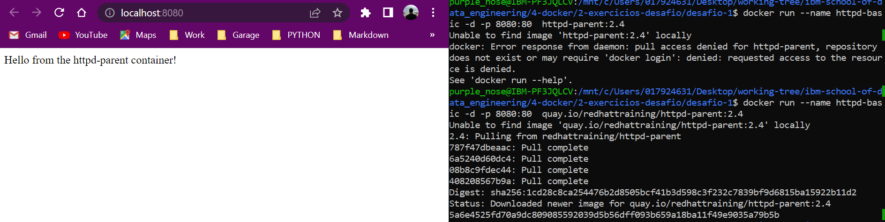
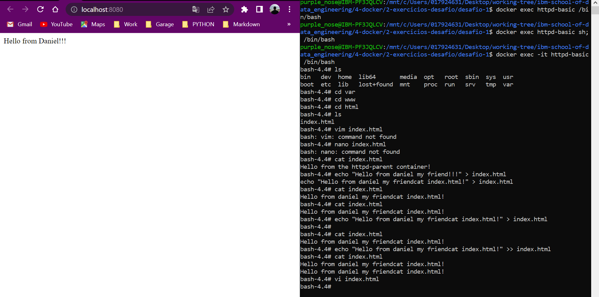
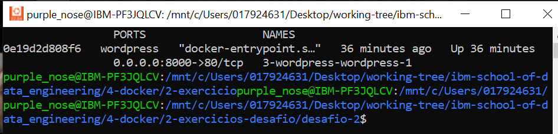

# :whale: Desafio 1

### 1. Execute um container baseado nas informações abaixo:
- [x] Baixe a imagem quay.io/redhattraining/httpd-parent;
- [x] Use a tag 2.4 da imagem;
- [x] O nome do container deve chamar httpd-basic;
- [x] O container deve ser executado em background;
- [x] O serviço deve ser disponivel na porta 8080 e redirecionar para a porta 80 do container.

### 2. Customize a mensagem apresentada em seu navegador quando é acessado o endereço http://localhost:8080.

- [x] Acesse o seu container que esta sendo executado;
- [x] Dentro do container acessar o endereço /var/www/html e verifique se dentro desta pasta existe um arquivo index.html;
- [x] Ainda dentro do container, subistitua a mensagem atual por uma nova "Ola mundo!" que esta no arquivo index.html.
- [x] Saia do container e verifique se a nova mensagem foi inserida.

### 3. Pare o container que esta sendo executado.

***

* To see - **challenge origin**, [click here](https://github.com/ricardocapeli/DockerStart/blob/main/exercicios/1_Desafio.md). :point_left::computer_mouse:
