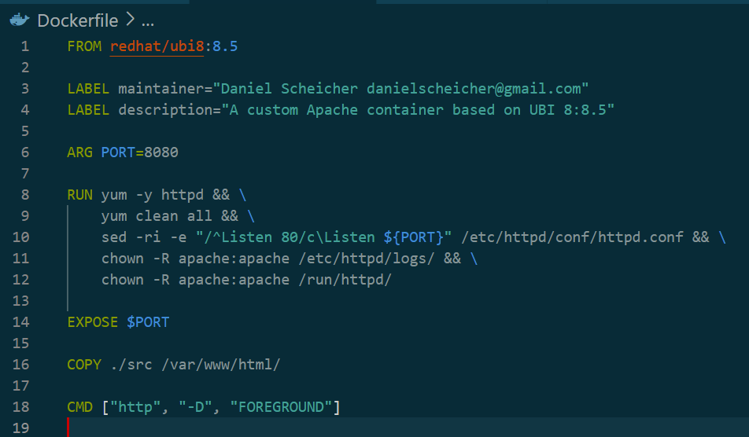
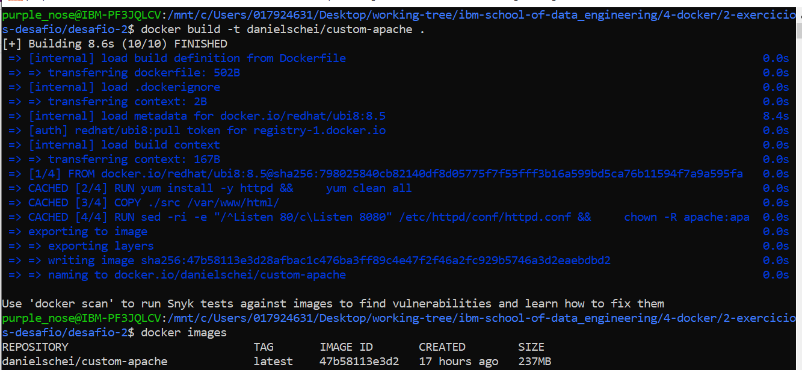
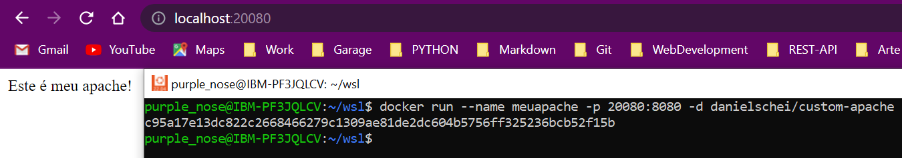
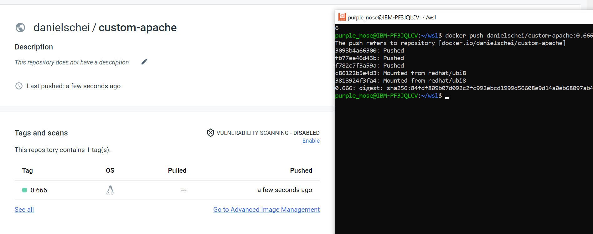

# :whale: Desafio 2

- [x] A imagem de base é redhat/ubi8:8.5;
- [x] Define o nome do autor desejado e o ID de e-mail com a instrução MAINTAINER;
- [x] Define a variável de ambiente PORT para 8080;
- [x] Instale o Apache (pacote httpd);
- [x] Altere o arquivo de configuração do Apache /etc/httpd/conf/httpd.conf para ouvir a porta 8080 em vez da porta 80 padrão;
- [x] Altere a propriedade das pastas /etc/httpd/logs e /run/httpd para o usuário e grupo apache (UID e GID são 48);
- [x] Exponha o valor definido na variável de ambiente PORT para que os usuários do contêiner saibam como acessar o Apache Web Server;
- [x] Crie uma pasta chamada src, e depois crie uma arquivo index.html. O conteúdo da pasta src/ deve ser copiado para o arquivo Apache DocumentRoot (/var/www/html/) dentro do container;
- [x] A pasta src deve conter apenas o arquivo index.html criado no passo anterior que imprime uma mensagem "Este é meu apache!";
- [x] Inicie o daemon Apache httpd em primeiro plano usando a instrução CMD e o seguinte comando:

### 2. Com o seu Dockerfile pronto, execute o comando docker build e o nome da imagem deve ser _seunome/custom-apache_ e verifique se esta imagem esta disponivel localmente.

### 3 Com a imagem disponível localmente, crie um novo container com as características abaixo:
- [x] Nome do container deve ser _meuapache_;
- [x] Faça um redirecionamento de portas, da porta do host 20080 para a porta do contêiner 8080;
- [x] Execute o container em modo daemon.

### 4 Verifique se o seu container esta sendo executado utilizando o comando docker e também através do seu navegador acessando o endereço https://localhost:20080.

### 5 Apos verificar se o container esta sendo executado corretamente e você conseguiu verificar a mensagem utilizando o seu navegador, para ele e então suba a sua imagem criada para o docker hub.

***

* To see **challenge origin**, [click here](https://github.com/ricardocapeli/DockerStart/blob/main/exercicios/2_Desafio.md). :point_left::computer_mouse:
