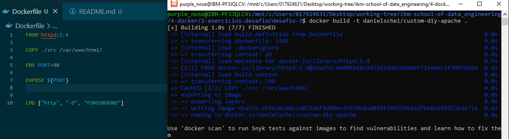
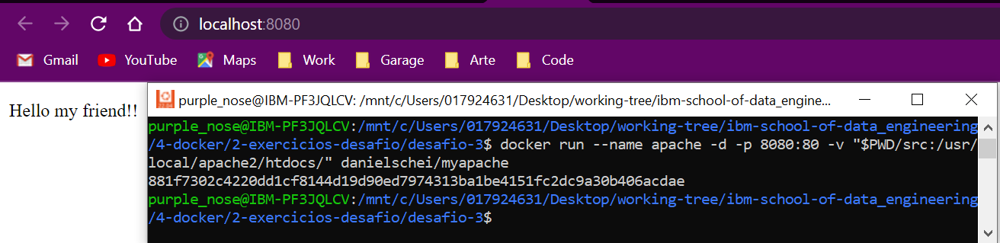
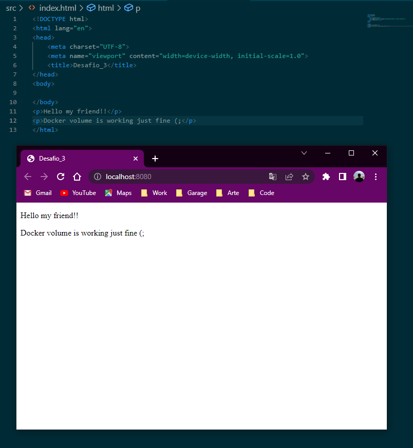

# :whale: Desafio 2

### 1. Crie uma imagem utilizando o _Dockerfile_ baseado nos parâmetros abaixo:
- [X] Crie uma pasta em seu desktop e nele crie um arquivo chamado index.html e nele construa uma pagina com um hello world!
- [X] A imagem que deve ser utilizada é httpd:2.4 (apache) ; 
- [X] Exponha o valor definido na variável de ambiente PORT para que os usuários do contêiner saibam como acessar o Apache Web Server;

- [X] Build image

### 2. Run container
- [X] O nome do container deve ser apache;
- [X] Executa-lo em modo daemon;
- [X] Faça o redirecionamento de porta 8080 para 80;
- [X] Faça o mapeamento da pasta que você criou com o arquivo index.html para dentro do container (local dentro do container: /usr/local/apache2/htdocs/);

### 3. Apos o container executado utilize o comando curl ou o seu navegador para acessar o arquivo index.html que foi criado.

### 4. Testando volume *(alterar documento index.html, atualizar localhost:8080 e verificar alteração em tempo real)*

***

* To see **challenge origin**, [click here](https://github.com/ricardocapeli/DockerStart/blob/main/exercicios/3_Desafio.md). :point_left::computer_mouse: