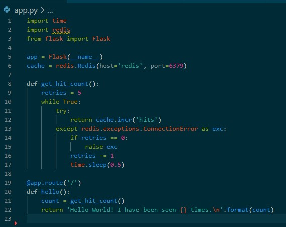
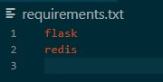
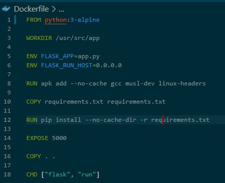
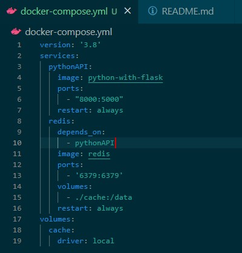
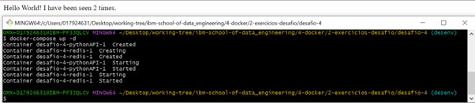
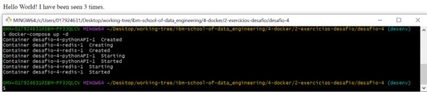
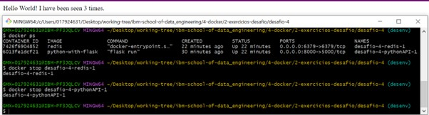
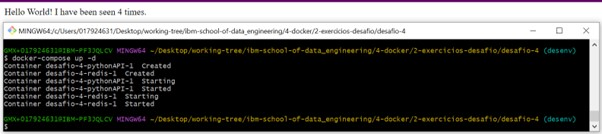

# :whale: Desafio 4

### 1. 1 Provisione uma aplicacao e persista os dados dela. Vamos utilizar neste exercicio o docker-compose.
- [x] Crie uma pasta para conter a estutura do seu projeto;
- [x] Neste exercicio vamos utilizar uma aplicacao em python e um redis;
- [x] Crie os arquivos: 
a) app.py 
 
b) requirements.txt 

### 2. Crie um arquivo Dockerfile.

### 3. Crie um arquivo docker-compose.yml. Nele voce deve ter a estrutura para que seja feita o build da sua aplicacao e suba junto uma outra aplicacao que o redis.

### 4. Considerações
* Fique bem atento pois estao faltando varias declaracoes para que suba a sua aplicacao em python e o redis que devem serem executados. Repare que existe uma declaracao de volume. Isso significa que os dados do redis serao armazenados e mesmo que o container se encerre os dados nao serao perdidos;

* Apos a construcao do arquivo, execute o comando necessario para que realize o build da aplicacao e entao suba os dois servicos;

* Repare que a cada refresh no seu navegador o numero e modificado; 
i) 2ª atualização (1ª não tirei print rs) 
 
ii) 3ª atualização 

* Execute o comando para baixar os dois servicos e entao suba novamente o docker-compose e veja se o numero permanece o mesmo ou ele inicia a partir do 1. Se iniciar a partir do 1 ele estara errado. E necessario rever a parte do volume do seu docker-compose. 
i) Stoppando os dois serviços 
 
ii) Subindo novamente e atualizando pagina 

***
* To see **challenge origin**, [click here](https://github.com/ricardocapeli/DockerStart/blob/main/exercicios/4_Desafio.md). :point_left::computer_mouse: