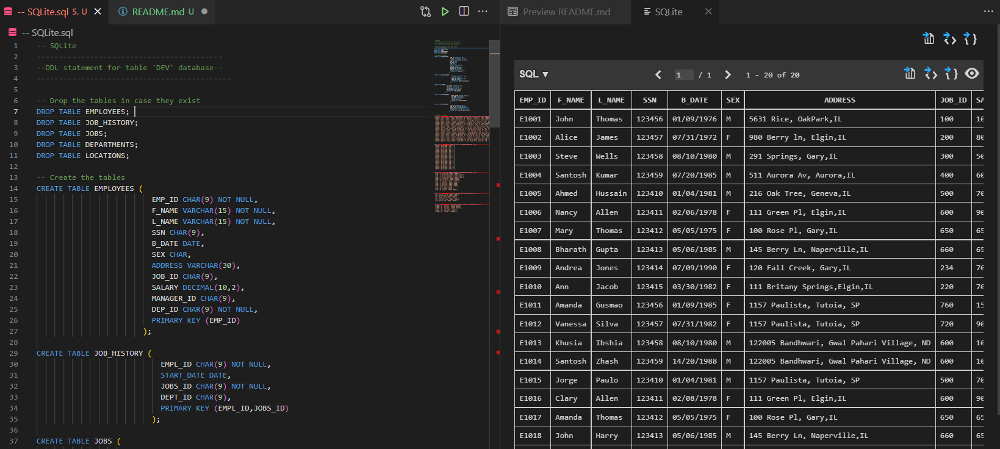

# :robot: IBM school of data engineering 
### :game_die::chains: SQL classes; :man_technologist: First class

***

## SUMÁRIO: :round_pushpin:

1. [Ambientação e CRUD (DML)](#1-ambientação-e-crud-dml)
- [I. SQLite usage on VSCode](#i-sqlite-usage-on-vscode)
- [II. Criando query](#ii-criando-query)
- [i. DROP](#i-drop)
    * [a) TRUNCATE (DML) ou DELETE](#a-truncate-dml-ou-delete)
- [ii. CREATE](#ii-create)
- [iii. INSERT](#iii-insert)

***
* ## Tema geral: 
## 1. AMBIENTAÇÃO E CRUD (DML)
[:top: ***Voltar ao topo***](#robot-ibm-school-of-data-engineering)

[check-code](CRUD-inicial.sql). :point_left::computer_mouse:

### I. SQLite usage on VSCode
[:top: ***Voltar ao topo***](#robot-ibm-school-of-data-engineering)

### II. Criando query
[:top: ***Voltar ao topo***](#robot-ibm-school-of-data-engineering)

- Realizou-se, primeiramente, o CRUD, DDL statments, na seguinte ordem:
#### i. DROP 
- Em contextos nos quais se intende realizar uma atualização na qual é necessária a exclusão, primeiramente, de uma tabela (schema + dados) - criou-se de forma errada uma tabela e necessita-se criar o schema novamente - recomenda-se iniciar uma query de construção com o DROP (deleta schema + dados). 
Como no desenvolvimento de um banco de dados, ao se realizarem testes, necessita-se recriar diversas vezes uma mesma tabela (mudança de regras de negócio, mal implementação, etc.), para esses casos já se deixa na iniciação da query o DROP para zerar o schema, tabela e conteúdo.

#### a) TRUNCATE (DML) ou DELETE
- Caso seja necessário sobrescrever apenas os dados, recomenda-se utilizar apenas o TRUNCATE, para não ter que construir o mesmo schema já criado.
- Também é possível utilizar o DELETE para deletar dados e schema de uma tabela, porém o DELETE varre toda tabela, linha a linha, pois o uso mais costumeiro do DELETE é para se usar com a clausula WHERE para deletar linhas específicas. Por isso, o DROP, quando se deseja deletar toda tabela, é mais eficiente.
No caso do SQLite, o DELETE sem clausula WHERE, aciona o TRUNCATE optimizer, pois o SQLite tem o comando TRUNCATE.
  
**OBS**: check [query](CRUD-sobrescreve-schema.sql). :point_left::computer_mouse:

#### ii. CREATE
- Recomenda-se criar já com algumas constraints - entity integrity, domain integrity e null constraints.
Não que depois não se possa implementá-los.
#### iii. INSERT
- É aqui que normalmente se implementa o Semantic Integrity Constraint (normalmente através das regras de negócio).

***

* [Voltar ao topo](#robot-ibm-school-of-data-engineering)

* [Voltar a pasta SQL](../../5-SQL/)

* [Voltar ao menu principal](https://github.com/DanScherr/ibm-school-of-data_engineering)

***

