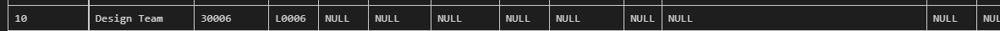
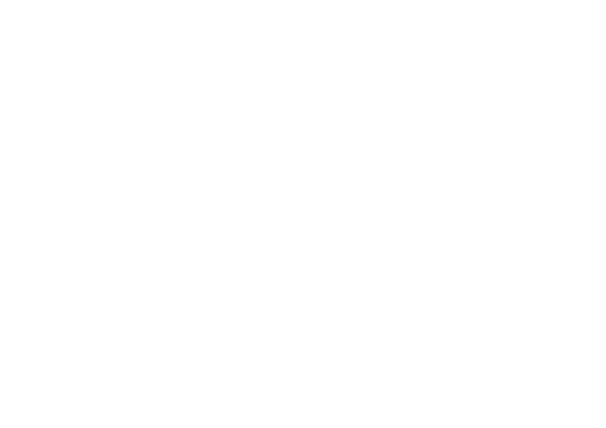

# :robot: IBM school of data engineering 
### :game_die::chains: SQL classes; :man_technologist: First class

***
* ## Tema geral: 
### - Relacionamento entre tabelas.

* ## Exercícios:
### 1. CRUD de população de tabela, consertar código.
[check-code:](CRUD-inicial.sql)  CRUD de população de tabela :point_left::computer_mouse:

### 2. Relacionar últimas 2 tabelas do modelo.
[check-code:](CRUD-inicial.sql) Relacionamento entre tabelas :point_left::computer_mouse:

### 3. Testagem de relacionamento
#### I. DEPARTMENTS:
> DEPARTMENTS.LOC_ID não têm uma constraint de relacionamento (foreign key) com EMPLOYEES, portanto, o time de design tem um MANAGER_ID não existente na tabela de EMPLOYEES.

> Para tal, realizou-se um DROP TABLE na tabela DEPARTMENTS, para recriá-la com a CONSTRAINT. Inseriou-se o mesmo set de dados iniciais para testagem:

 

***

## Utilizar Modelo de Entidades e Relacionamento (MER):
[:top: ***Voltar ao topo***](#robot-ibm-school-of-data-engineering)

***

* [Voltar ao topo](#robot-ibm-school-of-data-engineering)

* [Voltar a pasta SQL](../../5-SQL/)

* [Voltar ao menu principal](https://github.com/DanScherr/ibm-school-of-data_engineering)

***

