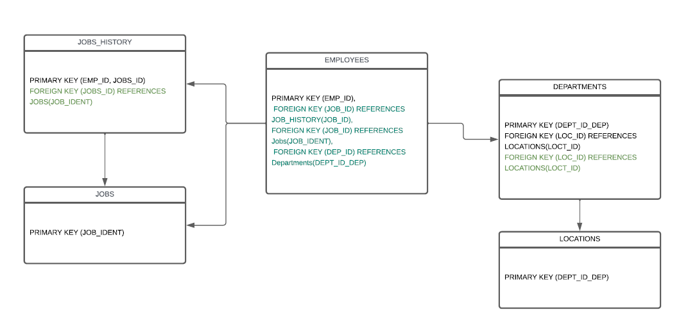

# :robot: IBM school of data engineering 
### :game_die::chains: SQL classes; :man_technologist: First class

***
* ## Tema geral: 
### - Relacionamento entre tabelas.

* ## Exercícios:
### 1. CRUD de população de tabela, consertar código.
[check-code:](CRUD-inicial.sql)  CRUD de população de tabela :point_left::computer_mouse:

### 2. Relacionar últimas 2 tabelas do modelo.
[check-code:](CRUD-inicial.sql) Relacionamento entre tabelas :point_left::computer_mouse:

### 3. Popular as outras tabelas com o INSERT INTO NOME_TABELA para esses dois campos não ficarem nulos (Temos duas linhas nulas).

 

***

## Utilizar Modelo de Entidades e Relacionamento (MER):
