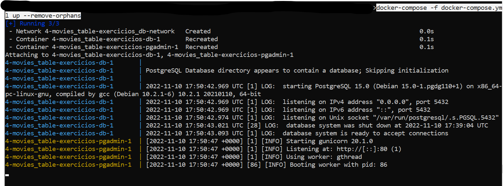

# :robot: IBM school of data engineering 
#### :mortar_board: *This folder contains the SQL challenges* :game_die::chains:

***

- # SUMÁRIO: :round_pushpin:
[:top: ***Voltar ao topo***](#robot-ibm-school-of-data-engineering)

***

 

- # AMBIENTAÇÃO:
[:top: ***Voltar ao topo***](#robot-ibm-school-of-data-engineering)
- ## Docker + PostgreSQL + pgAdmin

 

### 1. PULL de imagens:
[:top: ***Voltar ao topo***](#robot-ibm-school-of-data-engineering) 

obs: pulling the images is optional, because they can be pulled atomatically when you execute ***step ()***.

i. PostgreSQL1
-  $ docker pull postgres

ii. pgAdmin2
- $ docker pull dpage/pgadmin

 

- Referências:
1. [PostgreSQL on DockerHUB](https://hub.docker.com/_/postgres/).
2. [pgAdmin on DockerHUB](https://hub.docker.com/r/dpage/pgadmin4/).

 

## 2. Docker Compose:
[:top: ***Voltar ao topo***](#robot-ibm-school-of-data-engineering) 

``Compose is a tool for defining and running multi-container Docker applications. With Compose, you use a YAML file to configure your application’s services. Then, with a single command, you create and start all the services from your configuration.``

### i. Create docker-compose with YAML:
- [check-code](docker-compose.yml)
- it can be programmed to be restarted every time you get down your services
- it shows the logs live
- It creates automatically bridges networks between services:

``In terms of Docker, a bridge network uses a software bridge which allows containers connected to the same bridge network to communicate, while providing isolation from containers which are not connected to that bridge network.``1

### ii. Building docker-compose:
- $ docker-compose -f docker-compose.yml up --remove-orphans 

## 3. Accessing and configurating pgAdmin:
[:top: ***Voltar ao topo***](#robot-ibm-school-of-data-engineering) 

### i. Accessing pgAdmin:
- You must access via browser on: [localhost:8080](localhost:8080). 

- You must insert the e-mail you gave on the docker-compose and password to login. 

### ii. Registering server:
- RIght-click on Servers -> Register -> Server... 

- Type-in a name on General tab. 

- Type-in
    - Host-name (container name from docker-compose)
    - Port (port configured on the postgre container on docker-compose)
    - Username (setted on environment on docker-compose)
    - Password (setted on environment on docker-compose) 
    

## 4. Connecting to VsCode:
[:top: ***Voltar ao topo***](#robot-ibm-school-of-data-engineering) 

### i. Open VsCode.
### ii. Download PostgreSQL extension.

### iii. Connecting to server
- crtl + shift + P -> new query 

- Type server name as localhost 

- No need to insert database (optional).
- Username (postgres like given on docker-compose - and its the postgresql .deffault) 

- Insert password (like given on docker-compose). 

- Insert door (host door given on docker-compose - 8001). 

- Check the connection successfully pop-up ! 

## 5. Running query and CREATEing TABLE:
[:top: ***Voltar ao topo***](#robot-ibm-school-of-data-engineering) 

### i. Run CREATE, INSERT TABLE query:
- [Check query](./queries/disney_plus_titles-create-insert-table.sql). 

### ii. Run SELECT query to check it's creation:
- [Check query.](./queries/disney_plus_titles-select-table.sql) 

## 6. Referências:
[:top: ***Voltar ao topo***](#robot-ibm-school-of-data-engineering) 

1. [Docker Bridge Network](https://docs.docker.com/network/bridge/).

 

***

 

- # Enunciado: :man_teacher:
[:top: ***Voltar ao topo***](#robot-ibm-school-of-data-engineering)
> pipipipopopo

 

***

 

- # Exercise solution:
[:top: ***Voltar ao topo***](#robot-ibm-school-of-data-engineering)
- ## DER: DIAGRAMA DE ENTIDADE E RELACIONAMENTO - para resolução dos exercícios.

