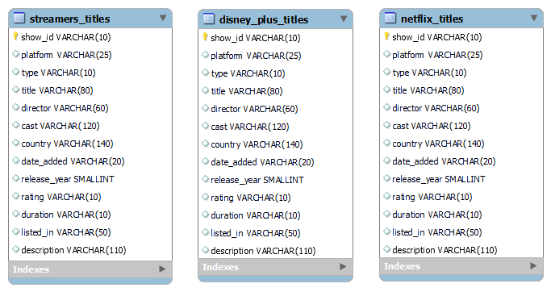
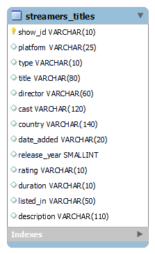

# :robot: IBM school of data engineering 
#### :mortar_board: *This folder contains the SQL challenges* :game_die::chains:

***

- # SUMÁRIO: :round_pushpin:
[:top: ***Voltar ao topo***](#robot-ibm-school-of-data-engineering)

- [AMBIENTAÇÃO:](#ambientação):

<br>

- [ENUNCIADO](#enunciado-man_teacher):
    - [Contexto](#1-contexto);
    - [Exercícios de normalização](#2-exercícios-de-normalização);
    - [Exercícios de casos de uso](#3-exercícios-de-casos-de-uso).

<br>

- [Exercise solution](#exercise-solution):
    - [DER - para resolução de exercícios](#1-der-diagrama-de-entidade-e-relacionamento---para-resolução-dos-exercícios);
    - [Normalização](#2-normalização)
    - [Resolução](#3-resolução)

***

<br>

- # AMBIENTAÇÃO:
[:top: ***Voltar ao topo***](#robot-ibm-school-of-data-engineering)
- Será utilizado o mesmo banco desenvolvido na [aula 4](../4-Movies_table-Exercicios/README.md).

<br>

***

<br>

- # Enunciado: :man_teacher:
[:top: ***Voltar ao topo***](#robot-ibm-school-of-data-engineering)
<br>

## 1. Contexto: <br>
``Somos uma empresa de Streaming que conseguiu um contrato para retransmitir dos nossos parceiros netflix, disney_plus e amazon_prime os seus conteúdos. A equipe de dados solicitou ao time diversas entregas que precisam ser realizadas para ajustes na base assim como as regras de negócio.``

## 2. Exercícios de normalização: <br>

1. Unifique as bases de dados do netflix, disney_plus e amazon_prime. Escolha uma das duas opcoes abaixo.
    1. Opcao mude o campo show_id das respectivas bases de modo que não tenhamos repeticao nos ids.
    1. Opcao voce pode construir uma nova coluna que represente o ID do tabelao. 

<br>

2. Normalize as colunas do tabelao.

> cast, country, listed_in, date_added, duration

<br>

3. Faca um diagrama de relacionamento (DER) das novas tabelas criadas.

<br>

4. Preencha os campos em branco com 'Null'.

<br><br>

## 3. Exercícios de negócio:

1. Informe qual a serie tem tempo de duracao somados de 30 horas ou mais.

<br>

2. A equipe precisa seguimentar o tempo de tela de cada conteudo de filmes, dessa forma, 
crie uma coluna que tenha a informacao particionada pela categoria e descubra o tempo maximo em horas de cada seguemento.<br>
<b>Exemplo:</b><br>
listed_in_split nova_coluna <br>
Documentaries  30<br>
TV Show        15

<br>

3. Crie uma nova coluna de classificao dos conteudos por estrelas pelos seguintes criterios.<br>
Se tiver os 5 criterios ganha 5 estrelas de classficao '*****'<br>
Se tiver os 4 criterios ganha 4 estrelas '****', assim susessivamente ate nenhuma estrela.
    
    1. O conteudo precisa ter no minimo 120 minutos - 1 uma  estrela 

    2. A producao ser americana. United Estates - 1 uma estrela 
    
    3. A producao ser francesa. France - 1 uma estrela 
    
    4. A quantidade do elenco precisa ser igual ou maior que 3 - 1 uma estrela 
    
    5. O numero dos diretores precisa ser igual a 1 ou 2 - 1 uma estrela 

<br>

4. Construa uma coluna que possua o rank dos melhores filmes pelos criterios da questao 7.

<br>

5. Construa uma coluna que possua o rank das melhores series pelos criterios da questao 7.

<br>

6. Desafio. 

    O nosso sistema desenvolveu uma campanha de publicidade no qual o cliente digita na busca dos conteudos a sua data de aniversario (DDMM) e o sistema retorna a sugestao de filmes que foram adicionados no sistema naquela data. 

    - Faca uma funcao ao qual recebe uma inteiro que correspode ao dia e mes e retorna 1 uma sugestao de filme aos quais o dia e mes de publicacao na plataforma dao match. Gere o campo sugestao_1

    - Alem disso, a classificao de conteudo precisa ser maior ou igual a 3 estrelas.

    - Caso o cliente nao goste da sugestao ele pode ter como retorno a sugestao anterior a essa. Gere o campo sugestao_2.

<br>

***

<br>

- # Exercise solution:
[:top: ***Voltar ao topo***](#robot-ibm-school-of-data-engineering)
## 1. DER: DIAGRAMA DE ENTIDADE E RELACIONAMENTO - para resolução dos exercícios.


## 2. Normalização:
[:top: ***Voltar ao topo***](#robot-ibm-school-of-data-engineering)

- Segue a baixo a ordem em que as queries foram executadas.
    
    I. CREATE/INSERT TABLE: 
    - [Amazon prime](./queries/1_N-prime.sql)
    - [Disney plus titles](./queries/1_N-disney_plus.sql)
    - [Netflix](./queries/1_N-netflix.sql)

    

    ```As tabelas foram criadas normalmente, adicionando apenas uma coluna chamada "platform" com valores default para cada nome de plataforma de streaming.```

    II. Passando para a 1ª normal e unindo bases à tabela [Streamers titles](./queries/1_N-streamers_all.sql) <br>

    

    ```Para a união das três tabelas em uma só, criou-se primeiramente o esquema da tabela "streamers_titles" com a coluna "platform" e, além disso, criou-se um "show_id" auto incrementável. Isto foi feito para que não nos preocupássemos com pipelines de processemento dos ids provenientes de cada tabela e termos uma numeração contínua.```
    
    ```A distinção sobre a plataforma, se dá pela coluna "platform", criada no passo I.```
    
    III. Passando para a 2ª forma normal com UNNEST nas tuplas: [View.](./queries/2_N-streamers_titles.sql), de relacionamento n <-> m:
    1. streamers_titlesXdirectors
    2. streamers_titlesXcast
    2. streamers_titlesXcountry
    3. streamers_titlesXlisted_in.


```A segunda forma já é suficiente para respondermos as questões apresentadas.```

## 3. Construção de tabelas auxiliares:
I. [Date.](./queries/aux_table-date.sql)

II. [Time.](./queries/aux_table-time.sql)

## 3 RESOLUÇÃO:
[:top: ***Voltar ao topo***](#robot-ibm-school-of-data-engineering)

1. [Check query](./queries/31-querie.sql)
1. Solucionada com o processo de normalização. [Ir para](#2-normalização)
1. Solucionada com o processo de normalização. [Ir para](#2-normalização)
1. Solucionada com o processo de normalização. [Ir para](#2-normalização)
1. [Check query](./queries/35-querie.sql)
1. [Check query](./queries/36-querie.sql)
1. [Check query](./queries/37-querie.sql)
1. [Check query](./queries/38-querie.sql)
1. [Check query](./queries/39-querie.sql)
1. [Check query](./queries/310-querie.sql)
1. [Check query](./queries/311-querie.sql)
1. [Check query](./queries/312-querie.sql)
1. [Check query](./queries/313-querie.sql)
1. [Check query](./queries/314-querie.sql)
1. [Check query](./queries/315-querie.sql)
1. [Check query](./queries/316-querie.sql)
1. [Check query](./queries/317-querie.sql)
1. [Check query](./queries/318-querie.sql)
1. [Check query](./queries/319-querie.sql)
1. [Check query](./queries/320-querie.sql)