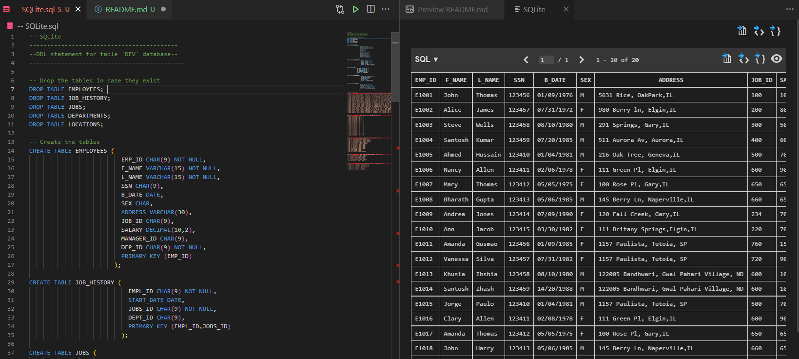

# :robot: IBM school of data engineering 
### :game_die::chains: SQL classes; :man_technologist: First class

***
* ## First lesson 
### 1. SQLite usage on VSCode

### 2. Criando query
    Realizou-se, primeiramente, o CRUD, DDL statments, na seguinte ordem:
#### I. DROP 
    - Em contextos nos quais se intende realizar uma atualização na qual é necessário a exclusão primeiramente de uma tabela (schema + dados) - criou-se de forma errada uma tabela e necessita-se criar o schema novamente - recomenda-se iniciar uma query de construção com o DROP (deleta schema + dados). 
    Como no desenvolvimento de um banco de dados, ao se realizarem testes, necessita-se recriar diversas vezes uma mesma tabela (mudança de regras de negócio, mal implementação, etc.), para esses casos já se deixa na iniciação da query o DROP para zerar o schema, tabela e conteúdo.
    Caso seja necessário sobrescrever apenas os dados, recomenda-se utilizar apenas o TRUNCATE, para não ter que construir o mesmo schema já criado.
    - Também é possível utilizar o DELETE para deletar dados e schema de uma tabela, porém o DELETE varre toda tabela, linha a linha, pois o uso mais costumeiro do DELETE é para se usar com a clausula WHERE para deletar linhas específicas. Por isso, o DROP, quando se deseja deletar toda tabela, é mais eficiente.
    No caso do SQLite, o DELETE sem clausula WHERE, aciona o TRUNCATE optimizer, pois o SQLite tem o comando TRUNCATE.

#### II. CREATE
    - Recomenda-se criar já com algumas constraints - entity integrity, domain integrity e null constraints.
    Não que depois não se possa implementá-los.
#### III. INSERT
    - É aqui que normalmente se implementa o Semantic Integrity Constraint (normalmente através das regras de negócio).

