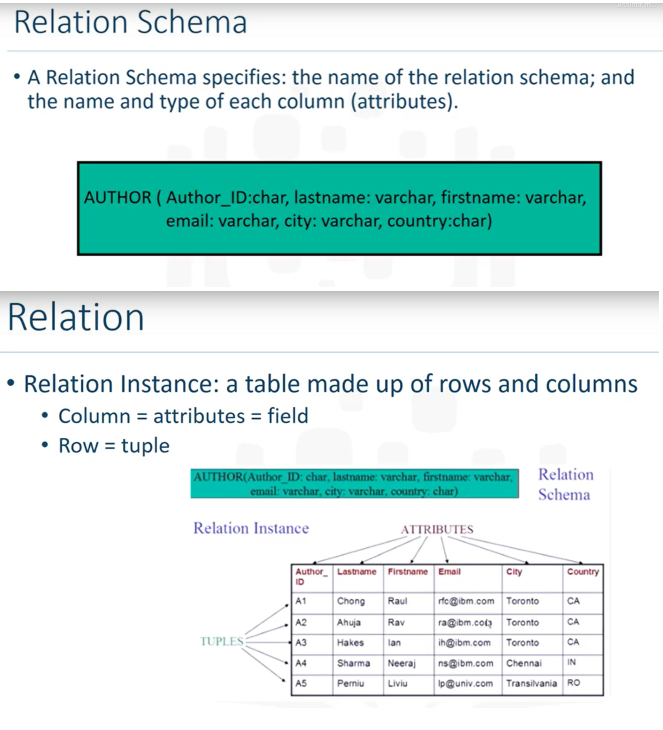

# :robot: IBM school of data engineering 
### :game_die::chains: SQL classes; :man_technologist: First class

***
* # Introdução
## I. Banco de dados transacionais (**OLTP**a):
- O OLTP (online transaction processing) são sistemas que se encarregam de registrar todas as transações contidas em uma determinada operação organizacional.
- A arquitetura mais comum de um sistema OLTP que usa dados transacionais é uma arquitetura de três camadas que normalmente consiste em uma camada de apresentação, uma camada de lógica de negócios e uma camada de armazenamento de dados.
- Uma transação é registrada corretamente somente se <u>todas as etapas envolvidas forem executadas e registradas</u>, seguindo os parametros da camada de negócios, normalmente implementadas pela camada lógica. toda a transação deve ser abortada e todas as etapas devem ser excluídas do sistema</u>. Assim, os sistemas OLTP devem estar em conformidade com as ***propriedades atômicas, consistentes, isoladas e duráveis*** (**ACID**b) para garantir a precisão dos dados no sistema.
  
**OBS:** para informações e conteúdo mais detalhado sobre:
 
a. **OLTP**, consultar [link](https://www.oracle.com/br/database/what-is-oltp/). :point_left::computer_mouse:
 
b. **ACID**, consultar [link](https://pt.wikipedia.org/wiki/ACID). :point_left::computer_mouse:

## II. SQL (structured query language):
- Os bancos de dados relacionais foram construídos especificamente para aplicações de transação. Eles incorporam todos os elementos essenciais necessários para armazenar e processar grandes volumes de transações, ao mesmo tempo em que são continuamente atualizados com novos recursos e funcionalidades para extrair mais valor desses ricos dados de transações.
- Os bancos de dados relacionais são projetados desde o início para fornecer a maior disponibilidade possível e o desempenho mais rápido. Eles fornecem simultaneidade e conformidade com ACID para que os dados sejam precisos, estejam sempre disponíveis e sejam facilmente acessíveis.
- Eles armazenam os dados em tabelas após extrair os relacionamentos entre os dados para que estes possam ser usados por qualquer aplicação, garantindo uma única fonte confiável.
- Segue um Schema de uma Banco de Dados Relacionais:

### II.i. Relacionamento entre tabelas e ACID:
- Para tornar possível, cria-se encadeamentos entre tabelas, como correntes, que são implementadas em SQL como: 

    CONSTRAINTS

- E seguem os tipos a seguir: 
    i. Entity Integrity Constraint: PRIMARY KEY.
     ii. Referential Integrity Constraint: FOREIGN KEY + PRIMARY KEYS.
     iii. Semantic Integrity Constraint: Correção do significado do dado (normalmente implementado seguindo regras de negócio na camada de aplicação).
     iv. Domain Constraint: Especifica os valores permitidos para um determinado atributo (também normalmente implementado na camada de aplicação).
     v. Null Constraint: Não pode ser nulo. (normalmente implementado no CREATE TABLE *nome-tabela* NOT NULL,)
     vi. Check constraint: limitação de aceite de valores (normalemnte, utiliza-se o CHECK no CREATE TABLE).

## III. SQLite:
- SQLite é uma biblioteca em linguagem C que implementa um banco de dados SQL embutido. Programas que usam a biblioteca SQLite podem ter acesso a banco de dados SQL sem executar um processo SGBD separado.
SQLite não é uma biblioteca cliente usada para conectar com um grande servidor de banco de dados, mas sim o próprio servidor. A biblioteca SQLite lê e escreve diretamente no arquivo de banco de dados no disco.
- O uso do SQLite é recomendado onde a simplicidade da administração, implementação e manutenção são mais importantes que incontáveis recursos que SGBDs, mais voltados para aplicações complexas, possivelmente implementam.
  
**OBS:** para interagir com um SQLite online, acessar [link](https://sqliteonline.com/).:point_left::computer_mouse:

## IV. VSCode:
- O Visual Studio Code é um editor de código-fonte desenvolvido pela Microsoft para Windows, Linux e macOS. Ele inclui suporte para depuração, controle de versionamento Git incorporado, realce de sintaxe, complementação inteligente de código, snippets e refatoração de código.
- É, atualmente, um dos editores de textos mais utilizados para desenvolver arquiteturas de software, versionar (com o git e github), testar e etc.

***

### 1. AMBIENTAÇÃO E CRUD (DML + TRUNCATE)
* [1-RH_table-Introducao](./1-RH_table-Introducao). :point_left::computer_mouse:
### 2. Criando query
* [2-RH_table-exercicio_1](./2-RH_table-exercicio). :point_left::computer_mouse:

  

***

* ## 

* ## SQL x NoSQL
    > à desenvolver