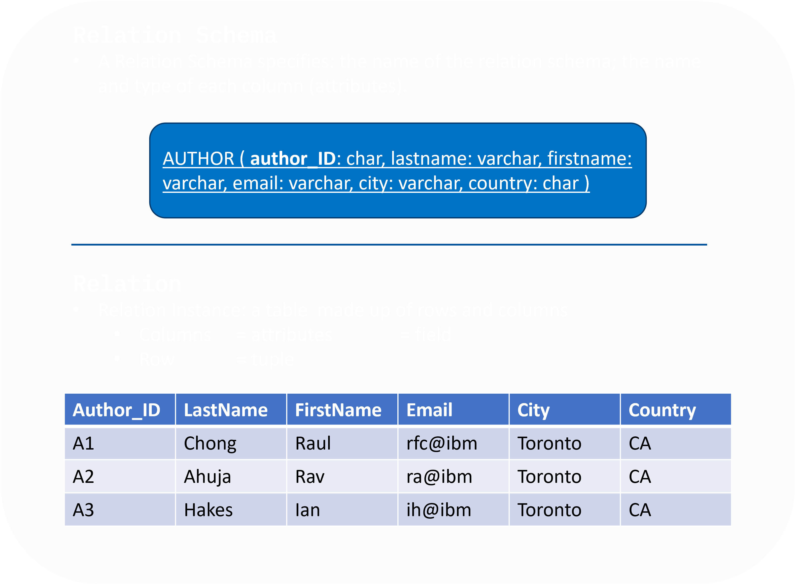

# :robot: IBM school of data engineering 
#### :mortar_board: *This folder contains the SQL challenges* :game_die::chains:

***

## SUMÁRIO: :round_pushpin:

- ### :man_student::books: [Introdução](#introdução-man_studentbooks)

1. [Bancos de dados transacionais](#1-banco-de-dados-transacionais-oltpi)
 i. [OLTP](#i-oltp-consultar-link-point_leftcomputer_mouse)
 ii. [ACID](#ii-acid-consultar-link-point_leftcomputer_mouse)

2. [SQL](#2-sql-structured-query-language)
     i. [Relacionamento entre tableas acid](#i-relacionamento-entre-tabelas-e-acid)

3. [SQLite](#3-sqlite)
4. [VsCode](#4-vscode)

- ### :man_technologist::books: [Exercícios](#exercícios-man_technologistbooks)
1. [Ambientação e CRUD](#1-ambientação-e-crud-dml--truncate)
2. [Relacionando tabelas](#2-criando-query)
3. [Casos de negócios](#3-casos-de-negócios)

- ### :fire::books: [Conceitos extras](#conceitos-extras-firebooks)
1. [Sistemas de Bancos de Dados](#1-sistemas-de-bancos-de-dados)

    i. [OLTP x OLAP](#i-oltp-x-olap-online-analytical-processing)
     ii. [Data Mesh](#ii-data-mesh-com-buckets-aws-sor-sot-e-spec)

2. [Paradigmas](#2-paradigmas-de-linguagens-e-estruturas-na-implementação-de-banco-de-dados)

***

* # Introdução :man_student::books:
[:top: ***Voltar ao topo***](#robot-ibm-school-of-data-engineering)

## 1. Banco de dados transacionais (**OLTP**i):
- O OLTP (online transaction processing) são sistemas que se encarregam de registrar todas as transações contidas em uma determinada operação organizacional (normalmente envolvem diversos agentes, retratados normalmente como entidades no ***Modelo de Entidade-Relacionamento***ii).
- A arquitetura mais comum de um sistema OLTP que usa dados transacionais é uma ***arquitetura de três camadas*** que normalmente consiste em uma camada de apresentação, uma camada de lógica de negócios e uma camada de armazenamento de dados.
- Uma transação é registrada corretamente somente se <u>todas as etapas envolvidas, por todas as entidades, forem executadas e registradas</u>, seguindo os parametros da camada de negócios, normalmente implementadas pela camada lógica (relacionamentos do tipo forte).
 
Se houver algum erro em qualquer uma das etapas, <u>toda a transação deve ser abortada e todas as etapas devem ser excluídas do sistema</u>. Assim, os sistemas OLTP devem estar em conformidade com as ***propriedades atômicas, consistentes, isoladas e duráveis*** (**ACID**iii) para garantir a precisão dos dados no sistema.

* **OBS:** para informações e conteúdo mais detalhado sobre:

    #### i. **OLTP**, consultar [link](https://www.oracle.com/br/database/what-is-oltp/). :point_left::computer_mouse:

    #### ii. **Modelo Entidade-Relacionamento**, consultar [link](https://www.lucidchart.com/pages/pt/o-que-e-diagrama-entidade-relacionamento). :point_left::computer_mouse:

    #### iii. **ACID**, consultar [link](https://pt.wikipedia.org/wiki/ACID). :point_left::computer_mouse:

## 2. SQL (structured query language):
- Os bancos de dados relacionais foram construídos especificamente para aplicações de transação (OLTP). Eles incorporam todos os elementos essenciais necessários para armazenar e processar grandes volumes de transações, ao mesmo tempo em que são continuamente atualizados com novos recursos e funcionalidades para extrair mais valor desses ricos dados de transações.
- Os bancos de dados relacionais são projetados desde o início para fornecer a maior disponibilidade possível e o desempenho mais rápido. Eles fornecem simultaneidade e conformidade com ACID para que os dados sejam precisos, estejam sempre disponíveis e sejam facilmente acessíveis.
- Eles armazenam os dados em tabelas após extrair os relacionamentos entre os dados para que estes possam ser usados por qualquer aplicação, garantindo uma única fonte confiável.
- Segue um Schema de uma Banco de Dados Relacionais:

### i. Relacionamento entre tabelas e ACID:
- Para tornar possível, cria-se encadeamentos entre tabelas, como correntes, que são implementadas em SQL como: 

    **CONSTRAINTS**

- E seguem os tipos a seguir: 
    i. **Entity Integrity Constraint:** PRIMARY KEY.
     ii. **Referential Integrity Constraint:** FOREIGN KEY + PRIMARY KEYS.
     iii. **Semantic Integrity Constraint:** Correção do significado do dado (normalmente implementado seguindo regras de negócio na camada de aplicação).
     iv. **Domain Constraint:** Especifica os valores permitidos para um determinado atributo (também normalmente implementado na camada de aplicação).
     v. **Null Constraint:** Não pode ser nulo. (normalmente implementado no CREATE TABLE *nome-tabela* NOT NULL,)
     vi. **Check constraint:** limitação de aceite de valores (normalemnte, utiliza-se o CHECK no CREATE TABLE).

## 3. SQLite:
- SQLite é uma biblioteca em linguagem C que implementa um ***banco de dados SQL embutido***. Programas que usam a biblioteca SQLite podem ter acesso a banco de dados SQL sem a necessidade de executar um processo SGBD separado.
- SQLite não é uma biblioteca cliente usada para conectar com um grande servidor de banco de dados, mas sim o próprio servidor. ***A biblioteca SQLite lê e escreve diretamente no arquivo de banco de dados no disco***.
- O uso do SQLite é recomendado onde a simplicidade da administração, implementação e manutenção são mais importantes que incontáveis recursos que SGBDs, mais voltados para aplicações complexas, possivelmente implementam.
  
**OBS:** para interagir com um SQLite online, acessar [link](https://sqliteonline.com/).:point_left::computer_mouse:

## 4. VSCode:
- O Visual Studio Code é um editor de código-fonte desenvolvido pela Microsoft para Windows, Linux e macOS. Ele inclui suporte para depuração, controle de versionamento Git incorporado, realce de sintaxe, complementação inteligente de código, snippets e refatoração de código.
- É, atualmente, um dos editores de textos mais utilizados para desenvolver arquiteturas de software, versionar (com o git e github), testar e etc.

***

* # Exercícios :man_technologist::books:
[:top: ***Voltar ao topo***](#robot-ibm-school-of-data-engineering)

### 1. AMBIENTAÇÃO E CRUD (DML + TRUNCATE)
* [1-RH_table-Introducao](./1-RH_table-Introducao). :point_left::computer_mouse:
### 2. Criando query
* [2-RH_table-exercicio_1](./2-RH_table-exercicio). :point_left::computer_mouse:

### 3. Casos de negócios
* [3-RH_table-Exercicios](./3-RH_table-Exercicios/). :point_left::computer_mouse:

***

* # Conceitos extras :fire::books:
[:top: ***Voltar ao topo***](#robot-ibm-school-of-data-engineering)
## 1. Sistemas de bancos de dados

### i. OLTP x OLAP (Online Analytical Processing)
> à desenvolver

### ii. Data-Mesh com Buckets AWS (SOR, SOT e SPEC)
> à desenvolver

## 2. Paradigmas de linguagens e estruturas na implementação de banco de dados
### i. SQL x NoSQL
> à desenvolver

***

* [Voltar ao topo](#robot-ibm-school-of-data-engineering)

* [Voltar ao menu principal](https://github.com/DanScherr/ibm-school-of-data_engineering)

