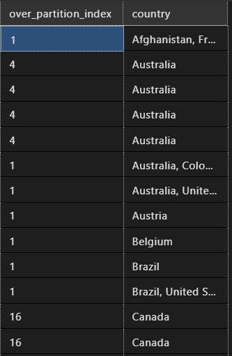
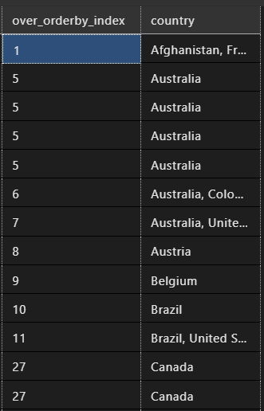
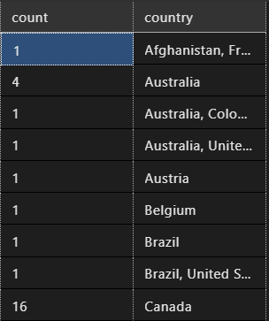

# :robot: IBM school of data engineering 
#### :mortar_board: *This folder contains the PySpark theory and challenges* :game_die::chains:

<br>

***

# **SUMÁRIO:** :round_pushpin:

<br>

- ### :man_student::books: [Introdução](#introdução-man_studentbooks)

<br>

***

# **Introdução** :man_student::books:
[:top: ***Voltar ao topo***](#robot-ibm-school-of-data-engineering)

<br>

## 1. **Revisão de conceitos:**
Foi solicitado pela gestora Angelica, que revisassemos os conceitos e funções de SQL para prosseguirmos com PySpark. 

- Para verificar **lista de tópicos a revisar**, [acessar.](./theory/revision.md) :point_left::computer_mouse:

- Por conta da grande maioria dos tópicos terem sido abordados nas aulas de [SQL](./../5-SQL/), será dada prioridade para explicar com exemplos o tópico sobre [Transact-SQl](./theory/revision.md/#4-transact-sql), que utilizam da clausula **OVER PARTITION BY**.
    - Assim como os tópicos de [funções de agregação](./theory/revision.md/#3-funções-de-agregação) utilizam do **GROUP BY**.
    - Documentação do [OVER PARTITION BY](https://learn.microsoft.com/pt-br/sql/t-sql/queries/select-over-clause-transact-sql?view=sql-server-ver16).

- Para realizar as consultas, serão utilizadas as tabelas criadas na [aula 5](./../5-SQL/5-Movies_table-Challenge/) de SQL.

### **1.1. OVER**
- Determina o particionamento e a ordenação de um conjunto de linhas antes da aplicação da função de janela associada.
```
OVER (   
       [ <PARTITION BY clause> ]  
       [ <ORDER BY clause> ]   
       [ <ROW or RANGE clause> ]  
      )
```

- Argumentos:
    - PARTITION BY divide o conjunto de resultados da consulta em partições.
    - ORDER BY define a ordem lógica das linhas dentro de cada partição do conjunto de resultados.
    - ROWS/RANGE limita as linhas dentro da partição com a especificação de pontos iniciais e finais na partição. Isso requer o argumento ORDER BY, e o valor padrão é do início da partição até o elemento atual se o argumento ORDER BY for especificado.

- Uma função de janela computa um valor para cada linha na janela. E estas são classificadas como:
    - Funções de [classificação](./theory/revision.md/#funções-de-classificação);
    - Funções de [agregação](./theory/revision.md/#funções-de-agregação);
    - Funções [analíticas](./theory/revision.md/#funções-analíticas);
    - Função [NEXT VALUE FOR](./theory/revision.md/#função-next-value-for).

- As funções passadas como atenção seguem: ```Classificação: RANK e ROW_NUMBER; Analíticas: LAG e LEAD.```
Por isso, serão cobertas 2 funções para cada tipo.

### **1.2. RANK**:

As tabelas a seguir mostram uma contagem com, respectivamente, [over partition by](./query/1-query.sql), [over order by](./query/3-query.sql) e [group by](./query/2-query.sql).





- Nota-se que **na primeira**, a contagem faz-se exclusivamente por cada partição, obedecendo a expressão dada pelo usuário. Ou seja, a contagem é zerada e realizada a partir de cada partição, indicando a contagem de linhas por partição.
- Já **na segunda**, percebe-se que não ocorre um particionamento que segmenta a contagem, esta flui de modo ordenada, criando como se fosse um sumário, indicando o segmento relativo à expressão dada pelo usuário e a contagem da primeira ocorrência deste na tabela.
- Por fim, **na terceira**, ocorre um ***resumo da primeira.*** Ou seja, ao invés de trazer todas as linhas da tabela (de forma repetitiva), trás a informação apenas uma vez.


<br>

***

# **Exercícios** :man_technologist::books:
[:top: ***Voltar ao topo***](#robot-ibm-school-of-data-engineering)

<br>

***

* [Voltar ao topo](#robot-ibm-school-of-data-engineering)

* [Voltar ao menu principal](https://github.com/DanScherr/ibm-school-of-data_engineering)


<a href="https://github.com/DanScherr">
    
</a>
