# :robot: **IBM school of data engineering**
#### :mortar_board: *This folder contains the PySpark theory and challenges* :game_die::chains:

<br>

***

# **SUMÁRIO:** :round_pushpin:

<br>

- ## :man_student::books: **[Introdução](#introdução-man_studentbooks)**


- ### **[1. Revisão de conceitos](#1-revisão-de-conceitos)**
    - **[1. Over](#1-over)**
    - **[2. Classificação](#2-classificação)**
        - [Rank()](#rank)
        - [Row_Number()](#row_number)

    - **[3. Agregação](#3-agregação)**

    - **[4. Analíticas](#4-analiticas)**
        - [Lag e Lead](#lag-e-lead)

- ### **[2. Spark](#2-spark)**
    - **[1. Arquitetura](#1-arquitetura)**
    - **[2. Elementos](#2-elementos)**
    - **[3. Componentes](#3-componentes)**
    - **[4. Transformações e ações](#4-transformações-e-ações)**
        - [1. Transformações](#1-transformações)
    - **[5. Instalação](#5-instalação)**
        - [1. VM com Ubuntu](#1-vm-com-ubuntu)
            - [Ubuntu Desktop](#ubuntu-desktop)
            - [Virtual Box](#virtual-box)
            - [1.Instanciar máquina Ubuntu na VM](#1-instanciar-máquina-ubuntu-na-vm)
            - [2. Instalando Spark na instância](#2-instalando-spark-na-instância)
            - [3. Preparando o ambiente](#3-preparando-o-ambiente)
            - [4. Instalando Java](#4-instalando-java)
            - [5. Instalando Spark](#5-instalando-spark)
            - [6. Definindo variáveis de ambiente](#6-definindo-variáveis-de-ambiente)
            - [7. Inicializando Spark](#7-inicializando-spark)
            - [8. Instalando bibliotecas adicionais](#8-instalando-bibliotecas-adicionais)
            - [9. Console putty para operar máquina virtual (SSH)](#9-console-putty-para-operar-máquina-virtual-ssh)
    - **[6. Estrutura de pastas do Spark](#6-estrutura-de-pastas-do-spark)**
    - **[7. Baixar dados de exemplo](#7-baixar-dados-de-exemplo)**
    - **[8. Estruturas de dados](#8-estruturas-de-dados)**
        - [1. RDDs](#1-rdds)
            - [1 Transformações e ações de um RDD](#1-transformações-e-ações-de-um-rdd)
        - [2. Data Set](#2-data-set)
        - [3. Data Frame](#3-data-frame)


- ### **[3. Big Data](#3-big-data)**


<br>

***

# **Introdução** :man_student::books:
[:top: ***Voltar ao topo***](#robot-ibm-school-of-data-engineering)

<br>

## **1. Revisão de conceitos:**
[:top: ***Voltar ao topo***](#robot-ibm-school-of-data-engineering)

Foi solicitado pela gestora Angelica, que revisassemos os conceitos e funções de SQL para prosseguirmos com PySpark. 

- Para verificar **lista de tópicos a revisar**, [acessar.](./theory/revision.md) :point_left::computer_mouse:

- Por conta da grande maioria dos tópicos terem sido abordados nas aulas de [SQL](./../5-SQL/), será dada prioridade para explicar com exemplos o tópico sobre [Transact-SQl](./theory/revision.md/#4-transact-sql), que utilizam da clausula **OVER PARTITION BY**.
    - Assim como os tópicos de [funções de agregação](./theory/revision.md/#3-funções-de-agregação) utilizam do **GROUP BY**.
    - Documentação do [OVER PARTITION BY](https://learn.microsoft.com/pt-br/sql/t-sql/queries/select-over-clause-transact-sql?view=sql-server-ver16).

- Para realizar as consultas, serão utilizadas as tabelas criadas na [aula 5](./../5-SQL/5-Movies_table-Challenge/) de SQL.

### **1. OVER**
[:top: ***Voltar ao topo***](#robot-ibm-school-of-data-engineering)

- Determina o particionamento e a ordenação de um conjunto de linhas antes da aplicação da função de janela associada.

```
OVER (   
       [ <PARTITION BY clause> ]  
       [ <ORDER BY clause> ]   
       [ <ROW or RANGE clause> ]  
      )
```

- Argumentos:
    - PARTITION BY divide o conjunto de resultados da consulta em partições.
    - ORDER BY define a ordem lógica das linhas dentro de cada partição do conjunto de resultados.
    - ROWS/RANGE limita as linhas dentro da partição com a especificação de pontos iniciais e finais na partição. Isso requer o argumento ORDER BY, e o valor padrão é do início da partição até o elemento atual se o argumento ORDER BY for especificado.

- Uma função de janela computa um valor para cada linha na janela. E estas são classificadas como:
    - Funções de [classificação](./theory/revision.md/#funções-de-classificação);
    - Funções de [agregação](./theory/revision.md/#funções-de-agregação);
    - Funções [analíticas](./theory/revision.md/#funções-analíticas);
    - Função [NEXT VALUE FOR](./theory/revision.md/#função-next-value-for).

- As funções passadas como atenção seguem: ```Classificação: RANK e ROW_NUMBER; Analíticas: LAG e LEAD.```
Por isso, serão cobertas 2 funções para cada tipo.

### **2. Classificação**:
[:top: ***Voltar ao topo***](#robot-ibm-school-of-data-engineering)

- #### **RANK():**
    As tabelas a seguir mostram a função [RANK()](https://learn.microsoft.com/pt-br/sql/t-sql/functions/rank-transact-sql?view=sql-server-ver16) com, respectivamente, [over partition by](./query/1-partition-by.sql), [over order by](./query/1-order-by.sql) e [group by](./query/1-count-group-by.sql).

    
    
    

    - Nota-se que **na primeira**, a contagem faz-se exclusivamente por cada partição, obedecendo a expressão dada pelo usuário. Ou seja, a contagem é zerada e realizada a partir de cada partição, indicando a contagem de linhas por partição.
    - Já **na segunda**, percebe-se que não ocorre um particionamento que segmenta a contagem, esta flui de modo ordenada, criando como se fosse um sumário, indicando o segmento relativo à expressão dada pelo usuário e a contagem da primeira ocorrência deste na tabela.
    - Por fim, **na terceira**, ocorre um ***resumo da primeira.*** Ou seja, ao invés de trazer todas as linhas da tabela (de forma repetitiva), trás a informação apenas uma vez.

- #### **ROW_NUMBER()**: 

    - A função [ROW_NUMBER()](https://learn.microsoft.com/pt-br/sql/t-sql/functions/row-number-transact-sql?view=sql-server-ver16) numera a saída de um conjunto de resultados. Mais especificamente, retorna o número sequencial de uma linha em uma partição de um conjunto de resultados, começando em 1 na primeira linha de cada partição.

    - ROW_NUMBER e RANK são semelhantes. ROW_NUMBER numera todas as linhas em sequência (por exemplo 1, 2, 3, 4, 5). RANK fornece o mesmo valor numérico para empates (por exemplo 1, 2, 2, 4, 5).

    - Assim como a função RANK, ROW_COUNT é reiniciada por agrupamento com o PARTITION BY e empilhada com o ORDER BY, como podemos nas tabelas abaixo respectivamente, [over partition by](./query/1-partition-by.sql) e [over order by](./query/1-order-by.sql):

    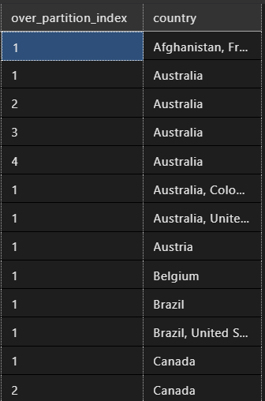
    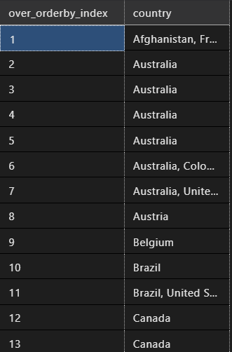

### **3. Agregação:**
[:top: ***Voltar ao topo***](#robot-ibm-school-of-data-engineering)

- #### **MIN() e MAX()**
    - Assim como a função RANK e ROW_COUNT, [MIN()](https://learn.microsoft.com/pt-br/sql/t-sql/functions/min-transact-sql?view=sql-server-ver16) E [MAX()](https://learn.microsoft.com/pt-br/sql/t-sql/functions/max-transact-sql?view=sql-server-ver16) são reiniciadas por agrupamento com o PARTITION BY e empilhadas com o ORDER BY, como podemos nas tabelas abaixo respectivamente, [over partition by](./query/1-partition-by.sql) e [over order by](./query/1-order-by.sql):

    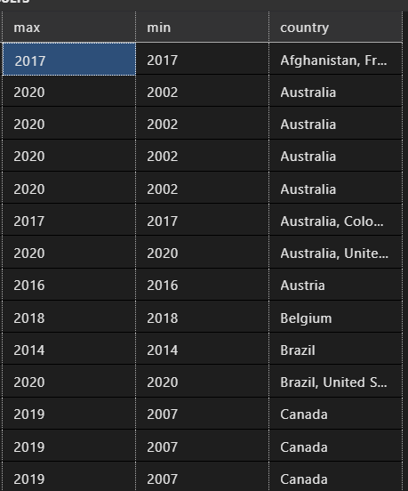
    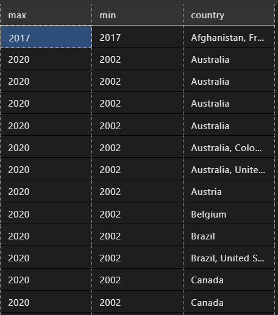

### **4. Analiticas:**
[:top: ***Voltar ao topo***](#robot-ibm-school-of-data-engineering)

- #### **LAG() e LEAD():**
    - [LAG()](https://learn.microsoft.com/pt-br/sql/t-sql/functions/lag-transact-sql?view=sql-server-ver16): Acessa os dados de uma linha anterior no mesmo conjunto de resultados sem usar uma autojunção.

        ```
        LAG (scalar_expression [,offset] [,default])  
        OVER ( [ partition_by_clause ] order_by_clause )  
        ```

    - [LEAD()](https://learn.microsoft.com/pt-br/sql/t-sql/functions/lead-transact-sql?view=sql-server-ver16): Acessa os dados de uma linha anterior no mesmo conjunto de resultados sem usar uma autojunção.

        ```
        LEAD (scalar_expression [,offset] [,default])  
        OVER ( [ partition_by_clause ] order_by_clause )  
        ```

        - **offset**:

            O número de linhas atrás da linha atual da qual obter um valor. Se não for especificado, o padrão será 1. offset pode ser uma coluna, subconsulta ou outra expressão avaliada para um inteiro positivo ou pode ser convertida implicitamente em bigint. offset não pode ser um valor negativo nem uma função analítica.

        - **default**:

            O valor a ser retornado quando offset estiver além do escopo da partição. Se um valor padrão não for especificado, NULL será retornado. default pode ser uma coluna, subconsulta ou outra expressão, mas não pode ser uma função analítica. default deve ter o tipo compatível com scalar_expression.

    - Segue a mesma lógica para partition by e order by e estão representadas nas imagens abaixo respectivamente, [over partition by](./query/1-partition-by.sql) e [over order by](./query/1-order-by.sql):
        
        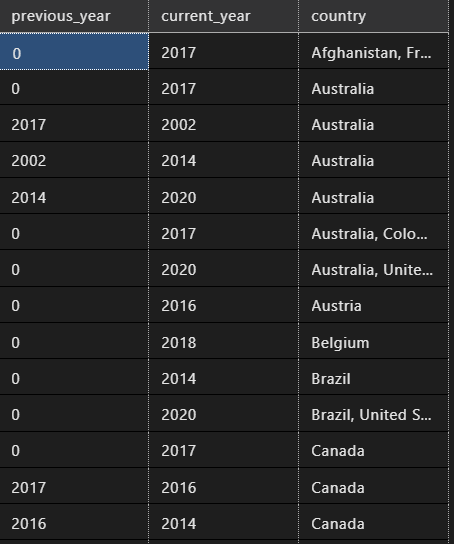
        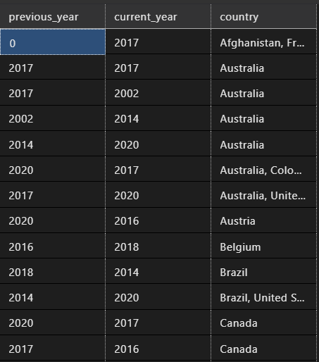

<br>
<br>

## **2. SPARK:**
[:top: ***Voltar ao topo***](#robot-ibm-school-of-data-engineering)

<br>

### **1. Arquitetura**:
[:top: ***Voltar ao topo***](#robot-ibm-school-of-data-engineering)

- **Driver:** Inicializar uma ***SparkSession***. Solicita recursos computacionais do ***Cluster Manager***, transforma as operações em ***DAGs*** e distribui estas pelos **Executers**.

- **Manager:** Gerencia os recursos do cluster. 
    - **Quatro disponíveis:** built-in standalone, YARN, Meses e Kubernetes.

- **Executer:** Roda em cada nó do cluster executando tarefas.


### **2. Elementos**:
[:top: ***Voltar ao topo***](#robot-ibm-school-of-data-engineering)

- **SparkContext**: Conexão transparente com o Cluster.
    - **Shell**:
        - Pode-se rodar um script Spark no shell (pyspark).
        - Cria-se uma sessão automaticamente chamada spark.
    - **Criando objeto em uma aplicação, arquivo .py**:
        - $ ```spark = (SparkSession 
                    .builder
                    .appname("Meuapp")
                    .getOrCreate()      )```
- **SparkSession**: Seção. Acesso ao SparkContext.
- **Aplication**: programa.

### **3. Componentes**:
[:top: ***Voltar ao topo***](#robot-ibm-school-of-data-engineering)

- **Job**: Tarefa.
- **Stage**: Divisão do job.
- **Task**: Menor unidade de trabalho. Uma por núcleo e por partição.

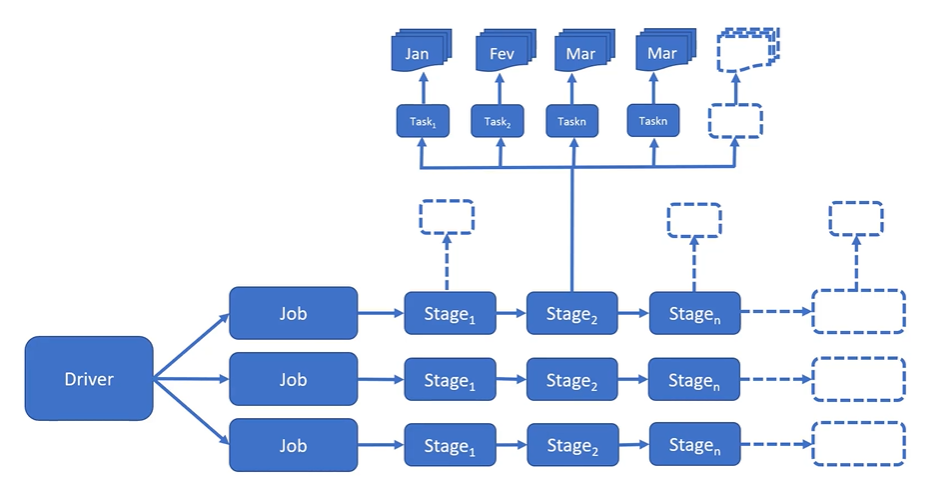

### **4. Transformações e ações**:
[:top: ***Voltar ao topo***](#robot-ibm-school-of-data-engineering)

- O processamento de transformação de fato só ocorre quando há uma ação, **Lazy Evaluation**: it only takes action after the "show" clause. In other words, if you tell spark to do some transformation operations (as filter, union, sample, etc.), it will only make them after the show clause, so that it can work a more efficient way of making them all together by simplifying the data engeneering transformation algorithym.

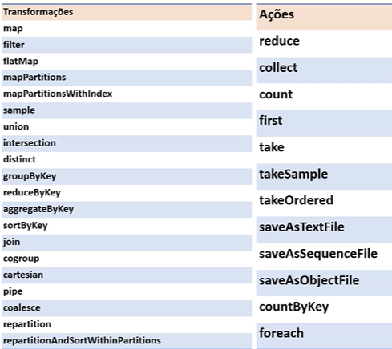

- **Um data frame é imutável:** traz tolerância a falha
- **Uma transformação gera um novo data frame**.

#### **1. Transformações**:

- **Narrow**: os dados estão em uma mesma partição

- **Wide**: os dados estão em mais de uma partição

## **5. Instalação**:
[:top: ***Voltar ao topo***](#robot-ibm-school-of-data-engineering)

### **1. VM com Ubuntu**:
[:top: ***Voltar ao topo***](#robot-ibm-school-of-data-engineering)

- #### **Ubuntu Desktop**:
- [.iso Download](https://ubuntu.com/download/desktop).

- #### **Virtual box**:
- [Download](https://www.virtualbox.org/wiki/Downloads).

#### **1. Instanciar máquina Ubuntu na VM**:
- [Follow these steps](https://ubuntu.com/tutorials/how-to-run-ubuntu-desktop-on-a-virtual-machine-using-virtualbox#2-create-a-new-virtual-machine)

#### **2. Instalando Spark na instância**:

#### **3. Preparando o ambiente**:

1. ```$ sudo apt update```
2. ```$ sudo apt -y upgrade```
#### **4. Instalando Java**:

1. ```sudo apt install curl mlocate default-jdk -y```
#### **5. Instalando Spark**:

1. [Access](https://spark.apache.org/downloads.html) !
2. Clique the link to the download page,
3. Copy link,
4. On terminal: ```wget <copied-link>```
5. Extraindo arquivo tar: ```tar xvf <nome-arquivo>```
6. Mover para past opt (onde ficam os aplicativos de pacotes de softw do linux. Questões de boas práticas): ```sudo mv <nome-pasta>/ /opt/spark```

#### **6. Definindo variáveis de ambiente**:

- Se encontram no arquivo **.bashrc**
1. Editando .bashrc: ```sudo gedit ~/.bashrc```
2. Adicionar ao final do arquivo:

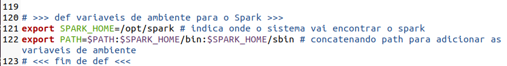

3. Informar o sistema que o arquivo foi atualizado: ```source ~/.bashrc```

#### **7. Inicializando Spark**:

1. Iniciar master stand-alone do Spark: ```start-master.sh```
-> permite acessar o spark no local host
2. Iniciar work-in-progress do Spark: ```start-worker.sh spark://localhost:7077```
3. Iniciar shell do Spark Nativo (linguagem Scala): ```start-shell```
4. Iniciar shell do Spark com PySpark: ```pyspark```

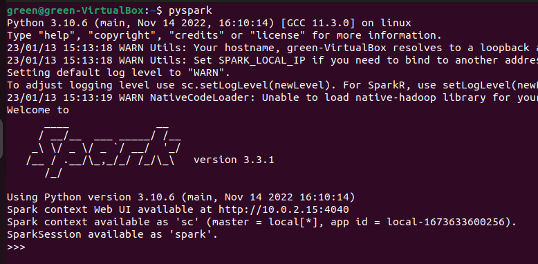

- É possível rodar Script de Spark no Shell do Spark de forma interativa, ou podemos criar uma aplicação SPark .py e rodá-la no shell de comando do próprio linux.


#### **8. Instalando bibliotecas adicionais**:

1. Instalar o instalador de pacotes pip: ```sudo apt install python3-pip```
2. ```pip install numpy```
3. ```pip install pandas```

#### **9. Console putty para operar máquina virtual (SSH):**

1. Habilitar SSH na VM
2. [Instalar putty](https://www.chiark.greenend.org.uk/~sgtatham/putty/latest.html) no Windows.
3. Configurar no Linux: 
    1. ```sudo apt install openssh-server```
    2. desligar máquina virtual
    3. na VirtualBox acessar configurações da máquina -> Rede -> aba Adaptador 1 -> avancado -> Redirecionamento de portas -> Adicionar -> Configurar:
        {
            Nome: ssh;
            Protocolo: TCP;
            End Ip do Hosp: 127.0.0.1;
            Porta Hosp: 22;
            Porta Conv: 22
        }
    -> "ok" -> "ok"
    4. Iniciar máquina virtual
4. COnfigurar putty:
    1. Configurar: {
        Host Name (IP): 127.0.0.1,
        Porta: 22
    }
    2. clicar "Open"
    3. Fazer Log-in
5. Acessar


## 6. Estrutura de pastas do Spark:
[:top: ***Voltar ao topo***](#robot-ibm-school-of-data-engineering)

- /opt/saprl/
- /examples/src/main/python/: exemplos para rodar
    - para executar: ```run-example SparkPi``` --> calculo de pi
    - script de contagem de palavra com arquivos de log:
        - ```cd /var/log```
        - ```run-example JavaWordCount kern.log```

## 7. Baixar dados de exemplo:
[:top: ***Voltar ao topo***](#robot-ibm-school-of-data-engineering)

- ```cd ~```
1. ```wget www.datascientist.com.br/bigdata/download.zip```
2. ```unzip download.zip```


## **8. Estruturas de dados:**
[:top: ***Voltar ao topo***](#robot-ibm-school-of-data-engineering)

### **1. RDDs**:
[:top: ***Voltar ao topo***](#robot-ibm-school-of-data-engineering)

 - Estrutura básica de baixo nível, complexo e verboso
 - Dados imutáveis distribuídos nos clusters
 - Em memória
 - Pode ser persistido em disco
 - Tolerante a falha
 - Operações sobre um RDD criam um novo RDD (por serem imutáveis)

#### **1 Transformações e ações de um RDD**:
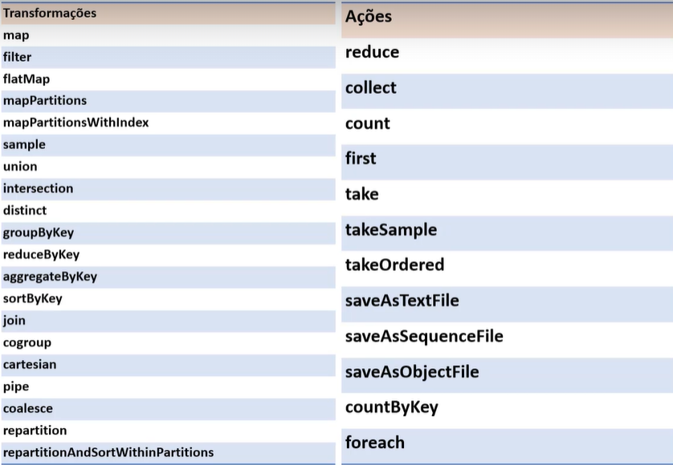

### **2. Data Set**:
[:top: ***Voltar ao topo***](#robot-ibm-school-of-data-engineering)


### **3. Data Frame**: 
[:top: ***Voltar ao topo***](#robot-ibm-school-of-data-engineering)


<br>

<br>

## **3. Big Data**:
[:top: ***Voltar ao topo***](#robot-ibm-school-of-data-engineering)

<br>

### **3.1. Introduação**:
[:top: ***Voltar ao topo***](#robot-ibm-school-of-data-engineering)

#### **3.1.1. Formatos**:
[:top: ***Voltar ao topo***](#robot-ibm-school-of-data-engineering)

- Armazens de dados modernos tendem a armazenar dados em formatos:
    - "Desaclopados" (independentes) de ferramentas e abertos;
    - Binários e compactados;
    - Suportam Schema (infos de colunas e tipos armazenados no próprio dado);
    - Podem ser particionados em:
        - Redundância;
        - Paralelismo.

- **Principais:**
    - **Parquet**: colunar, ***padrão Spark*** (mais adequado para leitura - armazem de dados é mais leitura);
    - **Apache ORC**: colunar, padrão Spark (mais adequado para leitura - armazem de dados é mais leitura);
    - **Avro**: linha (performance maior pra escrita. Muitos atributos e mais escrita - ex: banco de dados relacionais).

    <br>

    - **Para leitura**:
        - **ORC**: mais eficiente na criação (escrita) e na compressão (precisa de menos espaço).
        - **Parquet**: melhor performance na consulta (leitura).
        - **obs**: ideal é fazer benchmark.


<br>

***

# **Exercícios** :man_technologist::books:
[:top: ***Voltar ao topo***](#robot-ibm-school-of-data-engineering)

<br>

***

* [Voltar ao topo](#robot-ibm-school-of-data-engineering)

* [Voltar ao menu principal](https://github.com/DanScherr/ibm-school-of-data_engineering)


<a href="https://github.com/DanScherr">
    
</a>
