# :robot: IBM school of data engineering 

## :sailboat: **Kubernetes + Minikube** :game_die:

<br>

# **Sumário:** :round_pushpin:

- [Resumo](#resumo-memo)
    - [Descrição](#descrição)
    - [Recursos e capacidades](#recursos-e-capapacidades)
    - [DB2 de classe corporativa](#db2-de-classe-corporativa)
    - [Escalável e elástico](#escalável-e-elástico)
    - [Altamente disponível](#altamente-disponível)
    - [Altamente confiável](#altamente-confiável)
    - [Seguro de cima abaixo](#seguro-de-cima-abaixo)
- [Instanciando](#instanciando-busts_in_silhouette)
- [Conectando com VSCode](#conectando-com-vscode-satelliteglobe_with_meridians)
- [Rodando Queries](#rodando-querys-cyclonelink)    

<br><br>

# **Resumo:** :memo:

[:top: ***Voltar ao topo***](#robot-ibm-school-of-data-engineering)

## **Descrição:**

Um armazenamento de dados relacional totalmente gerenciado, de alto desempenho que executa o mecanismo do banco de dados DB2 de classe corporativa.

## **Recursos e capapacidades:**
Banco de dados DB2 como um serviço, totalmente gerenciado
Deixe o trabalho de TI para os especialistas. A nossa equipe mundial de engenheiros do CloudOps assegura a cobertura de serviço 24x7x365.

## **DB2 de classe corporativa**
Construído para enfrentar as cargas de trabalho de missão crítica mais difíceis do planeta, com recursos avançados, como gerenciamento de carga de trabalho adaptável, consulta de viagem no tempo, federação de consulta, IA em banco de dados, controle de acesso de linha/coluna, auditoria e suporte para conjuntos de dados JSON, XML e geoespaciais.

## **Escalável e elástico**
Escale e gerencie independentemente os requisitos de cálculo e de armazenamento para a sua implementação. Precisa de mais armazenamento? Basta um clique ou chamada da API.

## **Altamente disponível**
Disponível em configuração de alta disponibilidade de 3 nós dentro de uma região multizona, entregando um SLA confirmado de tempo de atividade de 99,99%.

## **Altamente confiável**
Backups gerenciados de autoatendimento para o armazenamento de objeto com recuperação point-in-time, permitindo que você restaure o seu banco de dados para um tempo especificado.

## **Seguro de cima abaixo**
Todos os seus dados são criptografados em movimento e em repouso.

<br>

# **Instanciando:** :busts_in_silhouette:
[:top: ***Voltar ao topo***](#robot-ibm-school-of-data-engineering)

### **1. Fazer cadastro na ibm cloud**;
### **2 Realizar Log-In**;
### **3. Criar recurso;**

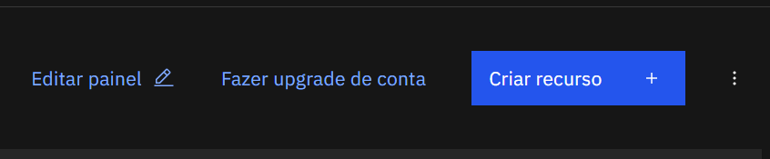

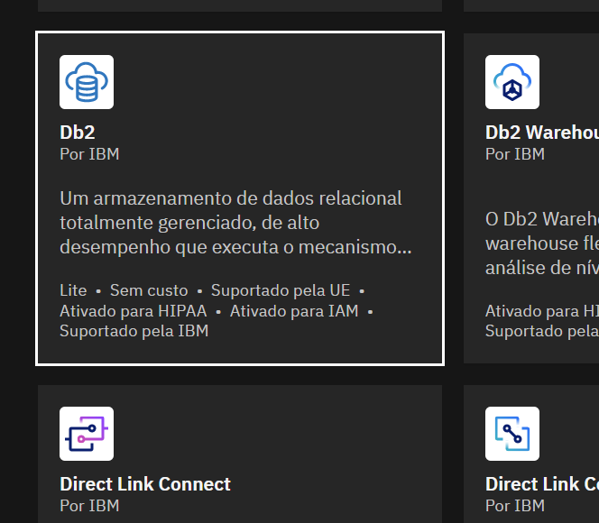

#### 3.1. Ache uma localização que permita uma instância gratuita ou pague..
```optei por uma instância gratuita - Lite - na região de Londres. (Tem Dallas também - US).```

#### 3.2. Preencha as informações necessárias, assine o termo de acordo e clique em "criar";
```optei por deixar as informações no padrão.```

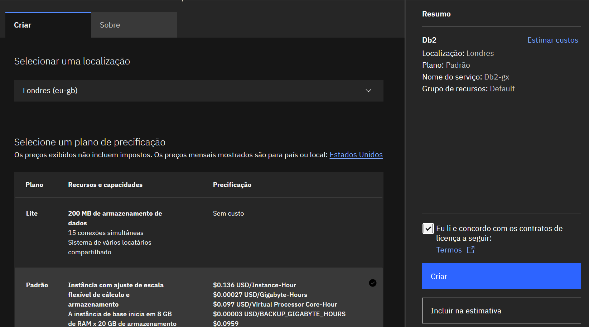

### **4. Aguarde enquanto é criada sua Instância**.

<br>

# **Conectando com VSCode:** :satellite::globe_with_meridians:
[:top: ***Voltar ao topo***]

### **1. Após criação, no Painel Principal, clique em "Listar recursos"**;

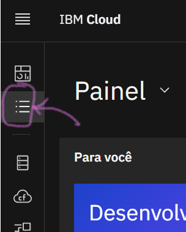

### **2. Na aba de "Database", identificar a instância criada e selecioná-la**;

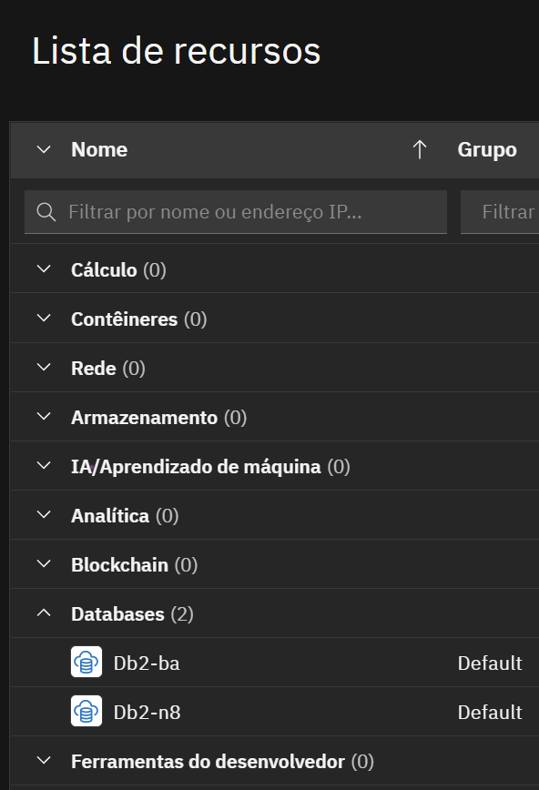


### **3. Selecionar "Credenciais de serviço"**;

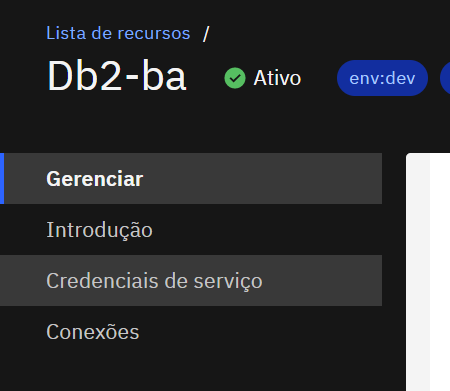

### **4. Criar "Nova credencial"**;

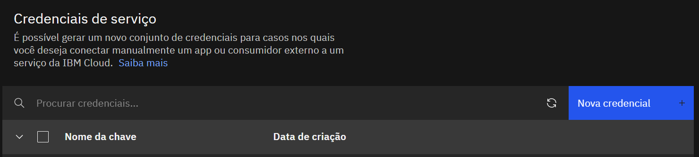

#### 4.1. Configurar nome a gosto e selecionar Função "Gerente";

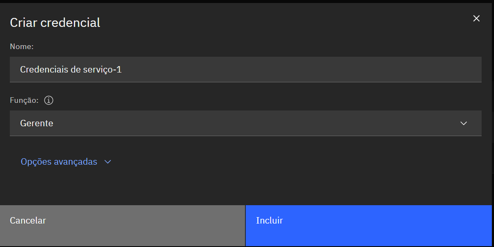

#### 4.2. Clicar em "Incluir";

#### 4.3. Expandir informações de credencial nova;
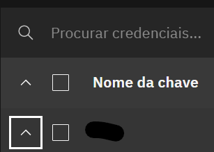

#### 4.4. Criar um arquivo .env e copiar as informações da credencial nova: ```username; password; host; port; database.```

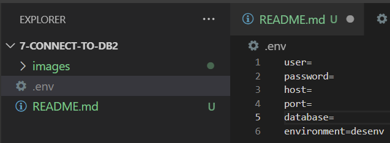

### **5. Volte a aba "Gerenciar" e clique em "Open UI"**;

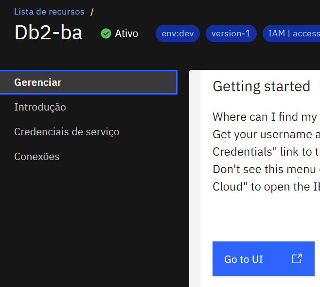

### **6. Clicar na aba "administração"**;

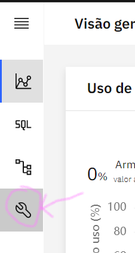

### **7. Selecionar seu tipo de Sistema Operacional**;
```no meu caso, utilizei Windows.```

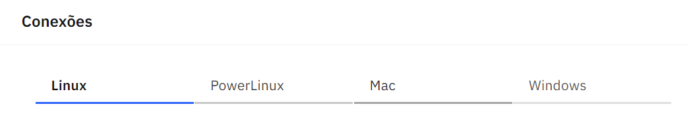

### **8. Realizar Download de Certificado**;

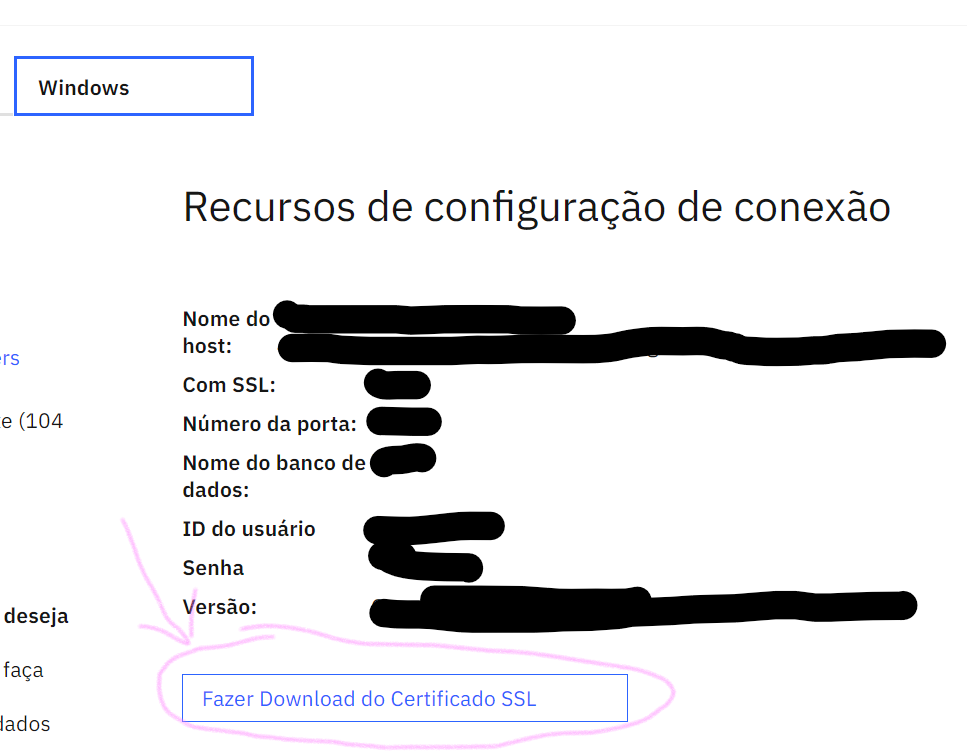

#### 8.1. Criar pasta e colar certificado;
```certifique-se de que arquivos .crt estejam no seu gitignore..```

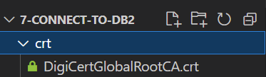

#### 8.2. Adicionar path do certificado ao .env;
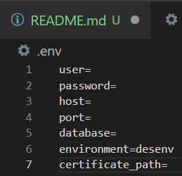

### **9. No VSCode, baixar extensão "Db2 Connect"**;

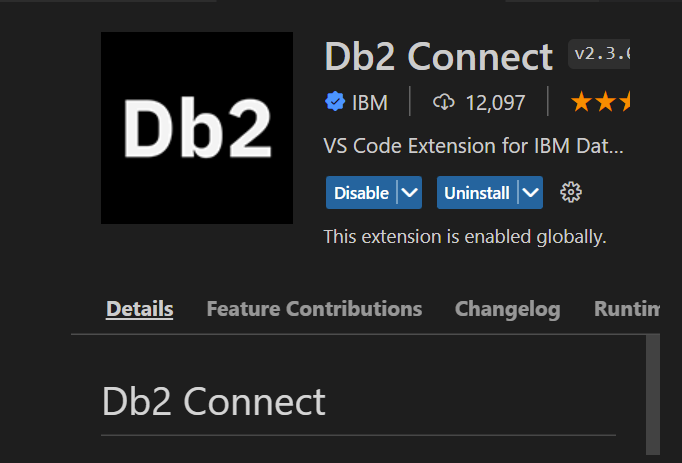

#### 9.1. Adicione a extensão na sua barra lateral;

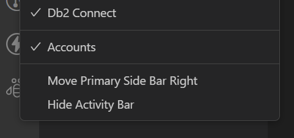

### **10. Abra a extensão Db2 Connect**;


### **11. Clique em "Connect"**;

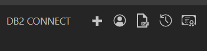

### **12. Clique em "Option 2"**;

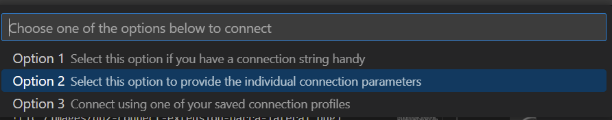

### **13. Preencha os campos do formulário com as informações de seu arquivo .env**;

#### 13.1. Habilite o campo "Enable SSl Security" e preencha com a variavel de ambiente "certificate_path";


### **14. Clicar em "Save and close"**;

### **15. Verificar sucesso na conexão**;

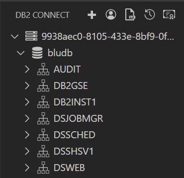

# **Rodando Querys**: :cyclone::link:
[:top: ***Voltar ao topo***](#robot-ibm-school-of-data-engineering)

### **1. Encontre o Schema com seu user ID e expanda a aba;**

### **2. Coloque o mouse em cima de "Tables" e clique no símbolo de mais à direita;**
#### 2.2. Uma query será aberta para criação de uma tabela padrão;

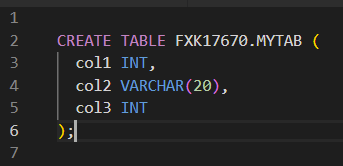

### 3. Clique com o botão direito na janela da query e depois em "Execute Current SQL File";
```ou Ctrl+Shift+F.```

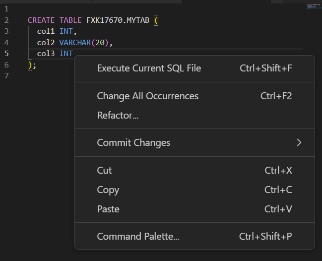

### 4. Para criar views, vá na aba Views e em seguida no mais à esquerda;
```e assim sucessivamente para cada aba dentro do Schema para o seu Login.```

***

* [Voltar ao topo](#robot-ibm-school-of-data-engineering)

<a href="https://github.com/DanScherr">
    
</a>
