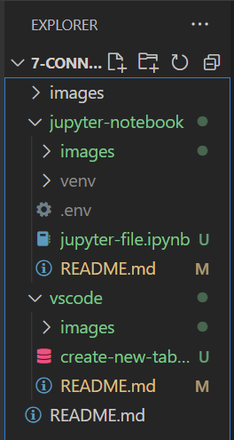

# :robot: IBM school of data engineering 

## :eye::bee::cloud: **IBM Cloud + DB2** :game_die::chains:

<br>

# **Sumário:** :round_pushpin:

1. [Criando e configurando ambiente virtual;](#1-criando-e-configurando-ambiente-virtual)
2. [Install and Configure CliDriver;](#2-install-and-configure-clidriver)
3. [Code your Jupyter Notebook file.](#3-code-your-jupyter-nootebook-file)


***

<br>

- # **Connect on Jupyter Notebook:**
[:top: ***Voltar ao topo***](#robot-ibm-school-of-data-engineering)

<br>

- ***The directory structure:***



<br>

## **1. Criando e configurando ambiente virtual:**
[:top: ***Voltar ao topo***](#robot-ibm-school-of-data-engineering)

<br>

### **1.1. Criar um ambiente virtual para testar e baixar bibliotecas**;
[to know how, click here to access.](https://github.com/DanScherr/learning-courses/tree/main/infra/ambiente-virtual-python) :point_left::link:

<br>

### **1.2. Create a new Jupyter Notebook file**;

<br>

### **1.3. Change the kernel of the Jupyter Notebook file to your venv python kernel**;
```./venv/Scripts/python.exe```

<br>


# **2. Install and Configure CLIDriver**;
[:top: ***Voltar ao topo***](#robot-ibm-school-of-data-engineering)

Para que nossa conexão possa ser estabelecida, precisamos de um driver. Por isso, iremos baixar o driver da ibm criado para realizar conexões SSL com uma instância do DB2.

<br>

- ### ***To connect to a DB2 database:***
    it's suposed that you have the connection information needed from an instance allready created.

    [Look how to create one here](./../README.md/#instanciando-busts_in_silhouette) :point_left::link:

<br>    

### **2.1. Download the IBM Data Server Driver for ODBC and CLI (CLI Driver)**;
[Click here](https://epwt-www.mybluemix.net/software/support/trial/cst/programwebsite.wss?siteId=849&h=null&p=null) :point_left::link:

<br>

### **2.2. Copy/Paste the clidriver folder into your venv/Lib/site-packages/ folder**;
```virtual environment folder.```

<br>

### **2.3. Configure your db2dsdriver.cfg file**;

- ***On Windows:***

    ```$ db2cli writecfg add -database bludb -host %HOST% -port %PORT%```


    ```$ db2cli writecfg add -database bludb -host 9938aec0-8105-433e-8bf9-0fbb7e483086.c1ogj3sd0tgtu0lqde00.databases.appdomain.cloud-port 32459 -parameter "SecurityTransportMode=SSL```

<br>

- ***The file will be created on:***

    ```C:\ProgramData\IBM\DB2\%Path-to-Virtual_Env-Directory%\cfg\db2dsdriver.cfg```

<br>

- ***To check orther SOs:*** 

    ```Open your UI > click on Connections > Choose your SO```;

<br>

### **2.4. Download your certificate:**
```From the UI/connections/```


- ***Copy it into the same directory as the db2dsdriver.cfg file***.

    ```C:\ProgramData\IBM\DB2\%Path-to-Virtual_Env-Directory%\cfg\db2dsdriver.cfg```

<br>

### **2.5. Validate your .cfg file:**
- ***You may always use the $db2cli command to work with the db2 connection driver.***
- It's located on:
```venv\Lib\site-packages\clidriver\bin```
- Run ```$db2cli -help``` to check what you can do.

<br>

- **Run the command:** 
```$ db2cli validate```

<br>

## **3. Code your Jupyter Notebook file.**
[:top: ***Voltar ao topo***](#robot-ibm-school-of-data-engineering)

[Code following this example.](./jupyter-file.ipynb) :point_left::link:

<br>

***

* [Voltar ao topo](#robot-ibm-school-of-data-engineering)

<a href="https://github.com/DanScherr">
    
</a>
