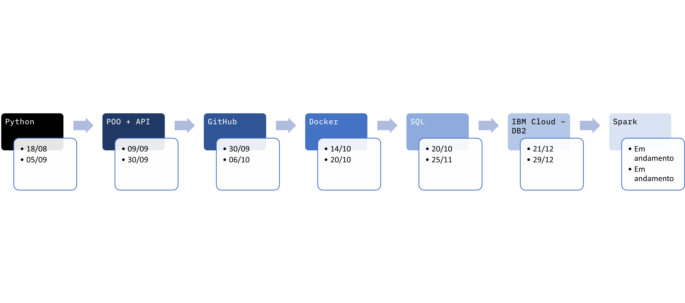

# :robot: IBM school of data engineering 
#### :mortar_board: *This folder contains the topics learned in my internship.*
* It follows the order by data that it was delivered.
* For each topic, we (interns) had both theorycal and practical lessons.

***

* ## Dates:

***

* ## Topics:

1. [Python/Pandas](./1-python)
2. [POO/Flask(api)](./2-programacao-orientada-a-objetos)
3. [GitHub](./3-git-git_hub)
4. [Docker](./4-docker)
5. [SQL](./5-SQL)
6. [PySpark](./6-Spark)

***

* [Voltar ao topo](#robot-ibm-school-of-data-engineering)

