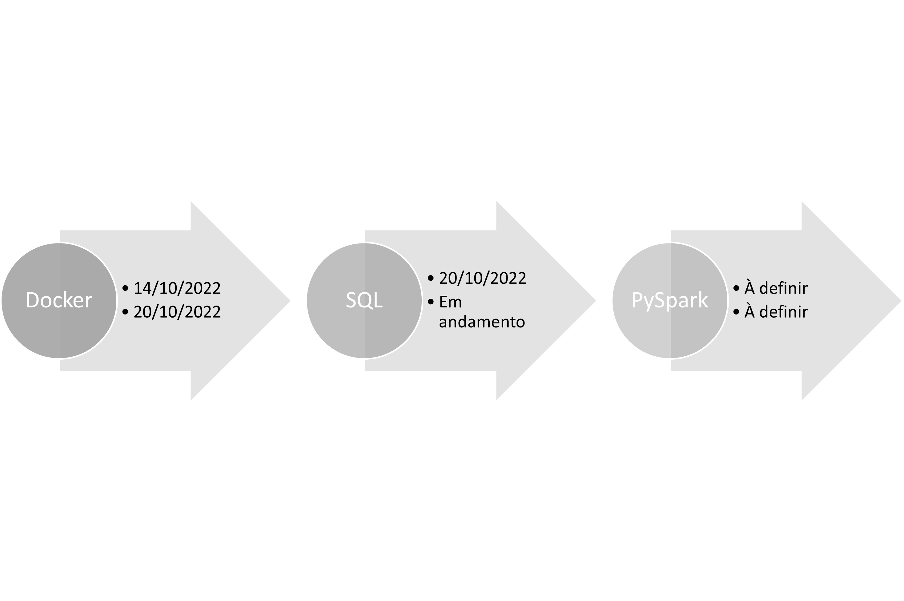

# :robot: IBM school of data engineering 
#### :mortar_board: *This folder contains the topics learned in my internship*
* It follows the order by data that it was delivered
* For the topics, we (interns) had both theorycal and practical lessons

***

* ## Dates:

***

* ## Topics:

1. [Python/Pandas](1-python-levelling)
2. [POO/Flask(api)](2-POO-banking_app)
3. [GitHub]()
4. [Docker](4-docker)
5. [SQL]()
6. [PySpark]()
